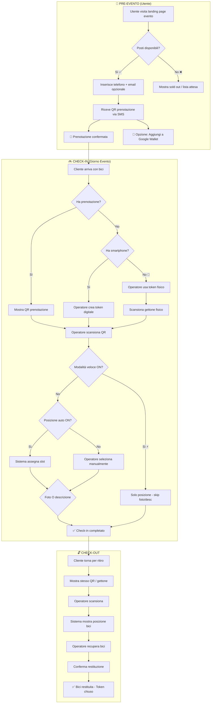

# 🚲 Dottò — Sistema Valet Biciclette per Eventi

> Un progetto di [Scintilla Cicloprogetti](https://www.scintillacicloprogetti.it/)

## 📋 Panoramica del Progetto

Progetta un sistema software completo per la gestione di un servizio valet per biciclette durante eventi. Il sistema supporta:
- **Token digitali** (QR via smartphone, integrabile con Google Wallet) — **preferenza default**
- **Token fisici** (gettoni plastificati con QR riutilizzabile) — **fallback per utenti senza smartphone**

### Obiettivi Primari
1. **Minima frizione utente**: registrazione con solo numero di telefono
2. **Prenotazione anticipata**: l'utente può prenotare prima dell'evento vedendo la disponibilità
3. **Efficienza operatore**: check-in rapido con modalità veloce nei momenti di punta
4. **Flessibilità**: adattamento dinamico al traffico (posizione auto, skip foto)

---

## 🎯 Principi di Design

### User Experience (Cliente)

| Dato | Obbligatorio | Uso |
|------|--------------|-----|
| Numero di telefono | ✅ | Ricezione ticket QR via SMS/WhatsApp |
| Email | ❌ | Conferma prenotazione + newsletter (opt-in) |

- **Zero account**: nessuna password, nessuna registrazione complessa
- **Prenotazione pre-evento**: l'utente vede i posti disponibili e prenota in anticipo
- **Ticket QR** inviato istantaneamente via SMS/WhatsApp
- **Integrazione Google Wallet**: il QR è aggiungibile direttamente al wallet con un tap
- **Link universale**: `https://dotto.bike/t/{token_id}` funziona per visualizzare QR, check-in e check-out

### Operator Experience
- Web app **mobile-first** ottimizzata per tablet/smartphone
- **Token digitale come default** — token fisico solo se cliente senza smartphone
- **Modalità veloce**: toggle per skip foto/descrizione nei momenti di punta
- **Posizione automatica**: assegnazione slot intelligente per velocizzare il flusso
- Operazioni rapide: check-in target <30 secondi in modalità veloce

---

## 🔄 Flusso Completo: Prenotazione → Check-in → Check-out


  
  <!-- Background -->
  <rect width="1200" height="900" fill="#f8fafc"/>
  
  <!-- Title -->
  <text x="600" y="35" text-anchor="middle" font-size="24" font-weight="bold" fill="#1e293b">🚲 Dottò — Flusso Completo</text>
  <text x="600" y="52" text-anchor="middle" font-size="10" fill="#64748b">by Scintilla Cicloprogetti</text>
  
  <!-- ==================== PRE-EVENTO Section ==================== -->
  <g id="pre-evento">
    <rect x="30" y="55" width="360" height="320" rx="12" fill="url(#grad-pre)" stroke="#3b82f6" stroke-width="2" filter="url(#shadow)"/>
    <text x="210" y="82" text-anchor="middle" font-size="14" font-weight="bold" fill="#1e40af">📅 PRE-EVENTO (Utente)</text>
    
    <!-- Node: Landing Page -->
    <rect x="110" y="100" width="200" height="40" rx="8" fill="#fff" stroke="#3b82f6" stroke-width="2"/>
    <text x="210" y="125" text-anchor="middle" font-size="12" fill="#1e293b">Visita landing page evento</text>
    
    <!-- Arrow down -->
    <line x1="210" y1="140" x2="210" y2="160" stroke="#3b82f6" stroke-width="2" marker-end="url(#arrowhead-blue)"/>
    
    <!-- Decision: Posti disponibili? -->
    <polygon points="210,165 280,195 210,225 140,195" fill="#fff" stroke="#3b82f6" stroke-width="2"/>
    <text x="210" y="199" text-anchor="middle" font-size="11" fill="#1e293b">Posti liberi?</text>
    
    <!-- Arrow SI -->
    <line x1="280" y1="195" x2="310" y2="195" stroke="#22c55e" stroke-width="2"/>
    <line x1="310" y1="195" x2="310" y2="250" stroke="#22c55e" stroke-width="2" marker-end="url(#arrowhead-green)"/>
    <text x="292" y="188" font-size="10" fill="#22c55e" font-weight="bold">Sì</text>
    
    <!-- Node: Inserisce telefono -->
    <rect x="60" y="255" width="160" height="35" rx="6" fill="#fff" stroke="#3b82f6" stroke-width="1.5"/>
    <text x="140" y="277" text-anchor="middle" font-size="11" fill="#1e293b">📱 Inserisce telefono</text>
    
    <!-- Node: Email opzionale -->
    <rect x="230" y="255" width="140" height="35" rx="6" fill="#fff" stroke="#94a3b8" stroke-width="1.5" stroke-dasharray="4"/>
    <text x="300" y="277" text-anchor="middle" font-size="10" fill="#64748b">✉️ Email (opz.)</text>
    
    <!-- Arrow down from telefono -->
    <line x1="140" y1="290" x2="140" y2="310" stroke="#3b82f6" stroke-width="2" marker-end="url(#arrowhead-blue)"/>
    
    <!-- Node: Riceve QR -->
    <rect x="60" y="315" width="160" height="35" rx="6" fill="#dbeafe" stroke="#3b82f6" stroke-width="2"/>
    <text x="140" y="337" text-anchor="middle" font-size="11" fill="#1e40af" font-weight="500">📲 Riceve QR via SMS</text>
    
    <!-- Arrow NO (sold out) -->
    <line x1="140" y1="195" x2="60" y2="195" stroke="#ef4444" stroke-width="2"/>
    <text x="95" y="188" font-size="10" fill="#ef4444" font-weight="bold">No</text>
    <rect x="40" y="180" width="20" height="30" rx="4" fill="#fef2f2" stroke="#ef4444" stroke-width="1.5"/>
    <text x="50" y="200" text-anchor="middle" font-size="14">❌</text>
  </g>
  
  <!-- Arrow from PRE to CHECK-IN -->
  <path d="M 390 335 Q 420 335 420 400" stroke="#3b82f6" stroke-width="3" fill="none" marker-end="url(#arrowhead-blue)"/>
  <rect x="395" y="355" width="50" height="20" rx="4" fill="#3b82f6"/>
  <text x="420" y="369" text-anchor="middle" font-size="9" fill="#fff" font-weight="bold">EVENTO</text>
  
  <!-- ==================== CHECK-IN Section ==================== -->
  <g id="checkin">
    <rect x="30" y="395" width="740" height="280" rx="12" fill="url(#grad-checkin)" stroke="#22c55e" stroke-width="2" filter="url(#shadow)"/>
    <text x="400" y="420" text-anchor="middle" font-size="14" font-weight="bold" fill="#166534">🚲 CHECK-IN (Giorno Evento)</text>
    
    <!-- Node: Cliente arriva -->
    <rect x="50" y="435" width="140" height="40" rx="8" fill="#fff" stroke="#22c55e" stroke-width="2"/>
    <text x="120" y="460" text-anchor="middle" font-size="11" fill="#1e293b">Cliente arriva</text>
    
    <!-- Arrow -->
    <line x1="190" y1="455" x2="215" y2="455" stroke="#22c55e" stroke-width="2" marker-end="url(#arrowhead-green)"/>
    
    <!-- Decision: Ha prenotazione? -->
    <polygon points="280,455 330,480 280,505 230,480" fill="#fff" stroke="#22c55e" stroke-width="2"/>
    <text x="280" y="478" text-anchor="middle" font-size="10" fill="#1e293b">Prenot.?</text>
    
    <!-- SI: Mostra QR -->
    <line x1="330" y1="480" x2="360" y2="480" stroke="#22c55e" stroke-width="2" marker-end="url(#arrowhead-green)"/>
    <rect x="365" y="460" width="110" height="35" rx="6" fill="#fff" stroke="#22c55e" stroke-width="1.5"/>
    <text x="420" y="482" text-anchor="middle" font-size="10" fill="#1e293b">📱 Mostra QR</text>
    
    <!-- NO: Ha smartphone? -->
    <line x1="280" y1="505" x2="280" y2="530" stroke="#f97316" stroke-width="2"/>
    <polygon points="280,535 330,560 280,585 230,560" fill="#fff" stroke="#f97316" stroke-width="2"/>
    <text x="280" y="558" text-anchor="middle" font-size="9" fill="#1e293b">Smartphone?</text>
    
    <!-- SI smartphone: Token digitale -->
    <line x1="330" y1="560" x2="360" y2="560" stroke="#22c55e" stroke-width="2" marker-end="url(#arrowhead-green)"/>
    <rect x="365" y="545" width="110" height="30" rx="6" fill="#dcfce7" stroke="#22c55e" stroke-width="1.5"/>
    <text x="420" y="564" text-anchor="middle" font-size="9" fill="#166534">🎫 Token digitale</text>
    
    <!-- NO smartphone: Token fisico -->
    <line x1="230" y1="560" x2="180" y2="560" stroke="#f97316" stroke-width="2"/>
    <rect x="60" y="545" width="120" height="30" rx="6" fill="#ffedd5" stroke="#f97316" stroke-width="1.5"/>
    <text x="120" y="564" text-anchor="middle" font-size="9" fill="#c2410c">📵 Token fisico</text>
    
    <!-- Merge to Scansiona -->
    <line x1="420" y1="495" x2="420" y2="510" stroke="#22c55e" stroke-width="2"/>
    <line x1="420" y1="510" x2="520" y2="510" stroke="#22c55e" stroke-width="2"/>
    <line x1="420" y1="575" x2="420" y2="590" stroke="#22c55e" stroke-width="2"/>
    <line x1="420" y1="590" x2="520" y2="590" stroke="#22c55e" stroke-width="2"/>
    <line x1="120" y1="575" x2="120" y2="610" stroke="#f97316" stroke-width="2"/>
    <line x1="120" y1="610" x2="520" y2="610" stroke="#f97316" stroke-width="2"/>
    <line x1="520" y1="510" x2="520" y2="610" stroke="#22c55e" stroke-width="2"/>
    <line x1="520" y1="550" x2="545" y2="550" stroke="#22c55e" stroke-width="2" marker-end="url(#arrowhead-green)"/>
    
    <!-- Node: Operatore scansiona -->
    <rect x="550" y="530" width="100" height="40" rx="8" fill="#fff" stroke="#22c55e" stroke-width="2"/>
    <text x="600" y="555" text-anchor="middle" font-size="10" fill="#1e293b">📷 Scansiona</text>
    
    <!-- Posizione -->
    <line x1="650" y1="550" x2="680" y2="550" stroke="#22c55e" stroke-width="2" marker-end="url(#arrowhead-green)"/>
    <rect x="685" y="535" width="80" height="30" rx="6" fill="#fff" stroke="#22c55e" stroke-width="1.5"/>
    <text x="725" y="554" text-anchor="middle" font-size="9" fill="#1e293b">📍 Posizione</text>
    
    <!-- Foto solo per token fisico -->
    <line x1="120" y1="575" x2="120" y2="630" stroke="#f97316" stroke-width="2"/>
    <rect x="55" y="635" width="130" height="30" rx="6" fill="#ffedd5" stroke="#f97316" stroke-width="2"/>
    <text x="120" y="654" text-anchor="middle" font-size="9" fill="#c2410c" font-weight="500">📸 Foto OBBLIGATORIA</text>
    <text x="120" y="680" text-anchor="middle" font-size="8" fill="#9a3412">(solo token fisico)</text>
  </g>
  
  <!-- Arrow from CHECK-IN to CHECK-OUT -->
  <path d="M 730 655 L 730 695" stroke="#22c55e" stroke-width="3" fill="none" marker-end="url(#arrowhead-green)"/>
  <rect x="705" y="667" width="50" height="18" rx="4" fill="#22c55e"/>
  <text x="730" y="679" text-anchor="middle" font-size="8" fill="#fff" font-weight="bold">CHECK ✓</text>
  
  <!-- ==================== CHECK-OUT Section ==================== -->
  <g id="checkout">
    <rect x="420" y="710" width="370" height="170" rx="12" fill="url(#grad-checkout)" stroke="#f59e0b" stroke-width="2" filter="url(#shadow)"/>
    <text x="605" y="735" text-anchor="middle" font-size="14" font-weight="bold" fill="#92400e">🔓 CHECK-OUT</text>
    
    <!-- Node: Cliente torna -->
    <rect x="440" y="750" width="100" height="35" rx="6" fill="#fff" stroke="#f59e0b" stroke-width="1.5"/>
    <text x="490" y="772" text-anchor="middle" font-size="10" fill="#1e293b">Cliente torna</text>
    
    <!-- Arrow -->
    <line x1="540" y1="767" x2="560" y2="767" stroke="#f59e0b" stroke-width="2" marker-end="url(#arrowhead-orange)"/>
    
    <!-- Node: Mostra QR -->
    <rect x="565" y="750" width="90" height="35" rx="6" fill="#fff" stroke="#f59e0b" stroke-width="1.5"/>
    <text x="610" y="772" text-anchor="middle" font-size="10" fill="#1e293b">📱 Mostra QR</text>
    
    <!-- Arrow -->
    <line x1="655" y1="767" x2="675" y2="767" stroke="#f59e0b" stroke-width="2" marker-end="url(#arrowhead-orange)"/>
    
    <!-- Node: Scansiona -->
    <rect x="680" y="750" width="90" height="35" rx="6" fill="#fff" stroke="#f59e0b" stroke-width="1.5"/>
    <text x="725" y="772" text-anchor="middle" font-size="10" fill="#1e293b">📷 Scansiona</text>
    
    <!-- Arrow down -->
    <line x1="605" y1="785" x2="605" y2="810" stroke="#f59e0b" stroke-width="2" marker-end="url(#arrowhead-orange)"/>
    
    <!-- Node: Posizione mostrata -->
    <rect x="520" y="815" width="170" height="35" rx="6" fill="#fef3c7" stroke="#f59e0b" stroke-width="1.5"/>
    <text x="605" y="837" text-anchor="middle" font-size="10" fill="#92400e">📍 Sistema mostra posizione</text>
    
    <!-- Arrow to final -->
    <line x1="690" y1="832" x2="715" y2="832" stroke="#22c55e" stroke-width="2" marker-end="url(#arrowhead-green)"/>
    
    <!-- Node: Bici restituita -->
    <rect x="720" y="815" width="55" height="35" rx="17" fill="#22c55e" stroke="#16a34a" stroke-width="2"/>
    <text x="747" y="837" text-anchor="middle" font-size="10" fill="#fff" font-weight="bold">✅</text>
  </g>
  
  <!-- ==================== LEGEND ==================== -->
  <g id="legend" transform="translate(810, 55)">
    <rect width="360" height="320" rx="10" fill="#fff" stroke="#e2e8f0" stroke-width="1" filter="url(#shadow)"/>
    <text x="180" y="28" text-anchor="middle" font-size="13" font-weight="bold" fill="#1e293b">📋 Legenda</text>
    
    <!-- Token types -->
    <rect x="20" y="45" width="150" height="28" rx="6" fill="#dcfce7" stroke="#22c55e" stroke-width="1.5"/>
    <text x="95" y="64" text-anchor="middle" font-size="10" fill="#166534">🎫 Token Digitale (default)</text>
    
    <rect x="190" y="45" width="150" height="28" rx="6" fill="#ffedd5" stroke="#f97316" stroke-width="1.5"/>
    <text x="265" y="64" text-anchor="middle" font-size="10" fill="#c2410c">📵 Token Fisico (fallback)</text>
    
    <!-- Modalità -->
    <text x="20" y="100" font-size="11" font-weight="600" fill="#1e293b">Modalità Operative:</text>
    
    <rect x="20" y="110" width="100" height="22" rx="4" fill="#fff" stroke="#22c55e" stroke-width="1"/>
    <text x="70" y="125" text-anchor="middle" font-size="9" fill="#1e293b">Standard</text>
    
    <rect x="130" y="110" width="100" height="22" rx="4" fill="#dbeafe" stroke="#3b82f6" stroke-width="1"/>
    <text x="180" y="125" text-anchor="middle" font-size="9" fill="#1e40af">📍 Auto</text>
    
    <rect x="240" y="110" width="100" height="22" rx="4" fill="#fef3c7" stroke="#f59e0b" stroke-width="1"/>
    <text x="290" y="125" text-anchor="middle" font-size="9" fill="#92400e">⚡ Veloce</text>
    
    <!-- Stati Token -->
    <text x="20" y="160" font-size="11" font-weight="600" fill="#1e293b">Stati Token:</text>
    
    <circle cx="35" cy="180" r="8" fill="#3b82f6"/>
    <text x="50" y="184" font-size="9" fill="#1e293b">reserved</text>
    
    <circle cx="120" cy="180" r="8" fill="#22c55e"/>
    <text x="135" y="184" font-size="9" fill="#1e293b">checked_in</text>
    
    <circle cx="220" cy="180" r="8" fill="#f59e0b"/>
    <text x="235" y="184" font-size="9" fill="#1e293b">checked_out</text>
    
    <circle cx="320" cy="180" r="8" fill="#ef4444"/>
    <text x="335" y="184" font-size="9" fill="#1e293b">lost</text>
    
    <!-- Dati Utente -->
    <text x="20" y="215" font-size="11" font-weight="600" fill="#1e293b">Dati Utente:</text>
    
    <rect x="20" y="225" width="130" height="22" rx="4" fill="#dcfce7" stroke="#22c55e" stroke-width="1.5"/>
    <text x="85" y="240" text-anchor="middle" font-size="9" fill="#166534">📱 Telefono (required)</text>
    
    <rect x="160" y="225" width="130" height="22" rx="4" fill="#fff" stroke="#94a3b8" stroke-width="1" stroke-dasharray="4"/>
    <text x="225" y="240" text-anchor="middle" font-size="9" fill="#64748b">✉️ Email (opzionale)</text>
    
    <!-- Identificazione bici -->
    <text x="20" y="270" font-size="11" font-weight="600" fill="#1e293b">Foto Bici:</text>
    <text x="20" y="288" font-size="9" fill="#64748b">• Token DIGITALE → Foto non richiesta</text>
    <text x="20" y="302" font-size="9" fill="#64748b">• Token FISICO → 📸 Foto OBBLIGATORIA</text>
    <text x="20" y="316" font-size="9" fill="#64748b">  (per identificare bici se gettone smarrito)</text>
  </g>
  
  <!-- Footer -->
  <text x="600" y="890" text-anchor="middle" font-size="10" fill="#94a3b8">Dottò — Sistema Valet Biciclette per Eventi | by Scintilla Cicloprogetti</text>
</svg>

---

## 🧩 Funzionalità Dettagliate

### 1. Prenotazione (Lato Utente — Pre-Evento)

**URL Pubblico:** `https://dotto.bike/evento/{slug}`

L'utente può:
- Vedere disponibilità posti in tempo reale
- Prenotare inserendo solo il numero di telefono
- Aggiungere email (opzionale) per conferma e newsletter
- Ricevere QR via SMS/WhatsApp
- Aggiungere QR a Google Wallet

**Vincoli:**
- Un solo token attivo per numero di telefono per evento
- Prenotazione valida fino a fine evento (o orario configurabile)
- No-show: token scade automaticamente

### 2. Check-in (Lato Operatore)

**Priorità tipo token:**
1. **Token digitale** (default) — cliente con smartphone
2. **Token fisico** (fallback) — cliente senza smartphone

**Modalità operative:**

| Modalità | Posizione | Quando usarla |
|----------|-----------|---------------|
| Standard | Manuale | Traffico normale |
| Posizione Auto | Automatica | Traffico medio-alto |

**Logica Foto Bici:**
- **Token DIGITALE** → ❌ Foto NON richiesta (il cliente può sempre recuperare il QR dal telefono o tramite numero)
- **Token FISICO** → ✅ Foto OBBLIGATORIA (serve per identificare la bici in caso di smarrimento del gettone)

> ⚠️ **Perché solo per token fisici?**  
> Con un token digitale, se il cliente "perde" il QR può sempre recuperarlo tramite il suo numero di telefono. Con un token fisico non c'è questo legame, quindi la foto è l'unico modo per identificare la bici.

### 3. Check-out (Ritiro Bici)

- Cliente mostra QR (digitale o gettone fisico)
- Operatore scansiona
- Sistema mostra: posizione bici, foto (se presente), orario check-in
- Operatore recupera e restituisce bici
- Token marcato come `checked_out`
- Token fisici: tornano disponibili per riuso

### 4. Fallback Perdita Token

**Token DIGITALE smarrito:**
```
Cliente dice di aver perso il QR:
└── Ricerca per numero di telefono → QR recuperato istantaneamente ✅
```

**Token FISICO smarrito:**
```
Cliente ha perso il gettone:
├── Ricerca per fascia oraria check-in
├── Verifica visiva con foto archiviate 📸
├── Confronto bici fisica con foto
└── Rilascio manuale con log di override + motivo
```

> 💡 Ecco perché la foto è obbligatoria solo per i token fisici: è l'unico modo per identificare la bici senza un legame digitale.

### 5. Dashboard Operatori/Admin

- Lista bici attualmente parcheggiate
- Mappa visiva rastrelliere con slot occupati/liberi
- Storico check-in/check-out con filtri
- Statistiche evento in tempo reale
- Gestione multi-evento
- Gestione operatori (PIN login)

---

## 🏗️ Stack Tecnologico

### Frontend — React + Mantine

| Tecnologia | Versione | Uso |
|------------|----------|-----|
| React | 18+ | Framework UI |
| Vite | 5+ | Build tool |
| Mantine | 7+ | UI Component Library |
| React Router | 6+ | Routing |
| TanStack Query | 5+ | Data fetching & caching |
| html5-qrcode | latest | Scanner QR camera |
| Zustand | latest | State management leggero |

**Caratteristiche:**
- PWA-ready (installabile, offline base)
- Mobile-first responsive
- Scanner QR integrato via camera
- Compressione immagini client-side prima upload

### Backend — FastAPI (Python)

| Tecnologia | Uso |
|------------|-----|
| FastAPI | Framework API REST |
| SQLAlchemy 2.0 | ORM async |
| Pydantic | Validazione dati |
| Alembic | Migrazioni DB |
| python-jose | JWT tokens |
| Twilio / MessageBird | SMS/WhatsApp |
| google-auth | Google Wallet API |
| Pillow | Elaborazione immagini |

### Database — PostgreSQL

| Tecnologia | Uso |
|------------|-----|
| PostgreSQL 15+ | Database principale |
| pgcrypto | UUID generation |

### Media Storage

| Opzione | Pro |
|---------|-----|
| Supabase Storage | Integrato, facile setup |
| Cloudflare R2 | Economico, S3-compatible |
| AWS S3 | Standard enterprise |

### Infrastruttura

| Componente | Suggerimento |
|------------|--------------|
| Hosting Frontend | Vercel / Cloudflare Pages |
| Hosting Backend | Railway / Render / Fly.io |
| Database | Supabase / Neon / Railway |

---

## 🗄️ Schema Database (PostgreSQL)

```sql
-- Estensioni
CREATE EXTENSION IF NOT EXISTS "pgcrypto";

-- =====================
-- TABELLA: events
-- =====================
CREATE TABLE events (
    id UUID PRIMARY KEY DEFAULT gen_random_uuid(),
    name VARCHAR(255) NOT NULL,
    slug VARCHAR(100) UNIQUE NOT NULL,
    description TEXT,
    location VARCHAR(255),
    location_coords POINT,  -- lat/lng opzionale
    
    start_date TIMESTAMP WITH TIME ZONE NOT NULL,
    end_date TIMESTAMP WITH TIME ZONE,
    checkin_opens_at TIMESTAMP WITH TIME ZONE,
    
    total_capacity INT NOT NULL,
    fast_mode_threshold INT DEFAULT 80,  -- % occupazione per suggerire fast mode
    
    is_active BOOLEAN DEFAULT true,
    created_at TIMESTAMP WITH TIME ZONE DEFAULT NOW(),
    updated_at TIMESTAMP WITH TIME ZONE DEFAULT NOW()
);

-- =====================
-- TABELLA: racks (rastrelliere)
-- =====================
CREATE TABLE racks (
    id UUID PRIMARY KEY DEFAULT gen_random_uuid(),
    event_id UUID NOT NULL REFERENCES events(id) ON DELETE CASCADE,
    rack_number INT NOT NULL,
    slots INT DEFAULT 12,
    label VARCHAR(50),  -- es. "Ingresso Nord"
    
    UNIQUE(event_id, rack_number)
);

-- =====================
-- TABELLA: operators
-- =====================
CREATE TABLE operators (
    id UUID PRIMARY KEY DEFAULT gen_random_uuid(),
    name VARCHAR(255) NOT NULL,
    phone VARCHAR(20),
    email VARCHAR(255),
    pin_hash VARCHAR(255) NOT NULL,  -- login con PIN
    
    is_admin BOOLEAN DEFAULT false,
    is_active BOOLEAN DEFAULT true,
    
    created_at TIMESTAMP WITH TIME ZONE DEFAULT NOW()
);

-- =====================
-- TABELLA: customers (dati minimi)
-- =====================
CREATE TABLE customers (
    id UUID PRIMARY KEY DEFAULT gen_random_uuid(),
    phone VARCHAR(20) NOT NULL,
    phone_normalized VARCHAR(20) NOT NULL,  -- formato E.164
    email VARCHAR(255),
    newsletter_opt_in BOOLEAN DEFAULT false,
    
    created_at TIMESTAMP WITH TIME ZONE DEFAULT NOW(),
    
    UNIQUE(phone_normalized)
);

-- =====================
-- TABELLA: tokens
-- =====================
CREATE TABLE tokens (
    id UUID PRIMARY KEY DEFAULT gen_random_uuid(),
    code VARCHAR(20) UNIQUE NOT NULL,  -- es. DOT-A7X9
    
    type VARCHAR(10) NOT NULL CHECK (type IN ('digital', 'physical')),
    status VARCHAR(15) DEFAULT 'reserved' CHECK (status IN (
        'available',    -- solo per token fisici non assegnati
        'reserved',     -- prenotato online, non ancora check-in
        'checked_in',   -- bici parcheggiata
        'checked_out',  -- bici ritirata
        'expired',      -- prenotazione scaduta (no-show)
        'lost'          -- token smarrito
    )),
    
    event_id UUID REFERENCES events(id),
    customer_id UUID REFERENCES customers(id),
    
    reserved_at TIMESTAMP WITH TIME ZONE,
    expires_at TIMESTAMP WITH TIME ZONE,
    
    created_at TIMESTAMP WITH TIME ZONE DEFAULT NOW()
);

-- Indice per ricerca token per cliente/evento
CREATE INDEX idx_tokens_customer_event ON tokens(customer_id, event_id);
CREATE INDEX idx_tokens_status ON tokens(status);

-- =====================
-- TABELLA: checkins
-- =====================
CREATE TABLE checkins (
    id UUID PRIMARY KEY DEFAULT gen_random_uuid(),
    token_id UUID NOT NULL REFERENCES tokens(id) UNIQUE,
    event_id UUID NOT NULL REFERENCES events(id),
    
    rack_id UUID NOT NULL REFERENCES racks(id),
    slot_number INT NOT NULL,
    
    -- Foto bici (OBBLIGATORIA solo per token fisici - serve per identificazione in caso smarrimento)
    bike_photo_url VARCHAR(500),
    
    -- Flags modalità
    auto_positioned BOOLEAN DEFAULT false,
    
    -- Timestamps e operatori
    checked_in_at TIMESTAMP WITH TIME ZONE DEFAULT NOW(),
    checked_out_at TIMESTAMP WITH TIME ZONE,
    checked_in_by UUID REFERENCES operators(id),
    checked_out_by UUID REFERENCES operators(id),
    
    -- Override manuale (per casi perdita token fisico)
    manual_override BOOLEAN DEFAULT false,
    override_reason TEXT,
    
    UNIQUE(rack_id, slot_number, checked_out_at)  -- uno slot occupato alla volta
);

-- Constraint: foto obbligatoria per token fisici
-- (enforced a livello applicativo, non DB, per flessibilità)

CREATE INDEX idx_checkins_active ON checkins(event_id) WHERE checked_out_at IS NULL;

-- =====================
-- TABELLA: activity_logs
-- =====================
CREATE TABLE activity_logs (
    id UUID PRIMARY KEY DEFAULT gen_random_uuid(),
    operator_id UUID REFERENCES operators(id),
    event_id UUID REFERENCES events(id),
    
    action VARCHAR(50) NOT NULL,  -- 'checkin', 'checkout', 'override', 'token_lost', etc.
    entity_type VARCHAR(50),       -- 'token', 'checkin', etc.
    entity_id UUID,
    
    metadata JSONB,  -- dati aggiuntivi flessibili
    ip_address INET,
    user_agent TEXT,
    
    created_at TIMESTAMP WITH TIME ZONE DEFAULT NOW()
);

CREATE INDEX idx_logs_event ON activity_logs(event_id, created_at DESC);

-- =====================
-- VISTE UTILI
-- =====================

-- Disponibilità evento
CREATE VIEW event_availability AS
SELECT 
    e.id as event_id,
    e.slug,
    e.name,
    e.total_capacity,
    e.start_date,
    e.checkin_opens_at,
    COUNT(t.id) FILTER (WHERE t.status IN ('reserved', 'checked_in')) as occupied,
    e.total_capacity - COUNT(t.id) FILTER (WHERE t.status IN ('reserved', 'checked_in')) as available,
    ROUND(
        COUNT(t.id) FILTER (WHERE t.status IN ('reserved', 'checked_in'))::numeric 
        / NULLIF(e.total_capacity, 0) * 100
    ) as occupancy_percent
FROM events e
LEFT JOIN tokens t ON t.event_id = e.id
WHERE e.is_active = true
GROUP BY e.id;

-- Slot disponibili per evento
CREATE VIEW available_slots AS
SELECT 
    r.event_id,
    r.id as rack_id,
    r.rack_number,
    r.label as rack_label,
    s.slot_number
FROM racks r
CROSS JOIN generate_series(1, r.slots) AS s(slot_number)
WHERE NOT EXISTS (
    SELECT 1 FROM checkins c 
    WHERE c.rack_id = r.id 
    AND c.slot_number = s.slot_number
    AND c.checked_out_at IS NULL
);

-- =====================
-- FUNZIONI
-- =====================

-- Prossimo slot disponibile
CREATE FUNCTION get_next_available_slot(p_event_id UUID)
RETURNS TABLE(rack_id UUID, rack_number INT, slot_number INT, rack_label VARCHAR) AS $$
BEGIN
    RETURN QUERY
    SELECT av.rack_id, av.rack_number, av.slot_number, av.rack_label
    FROM available_slots av
    WHERE av.event_id = p_event_id
    ORDER BY av.rack_number, av.slot_number
    LIMIT 1;
END;
$$ LANGUAGE plpgsql;

-- Genera codice token univoco
CREATE FUNCTION generate_token_code() RETURNS VARCHAR(20) AS $$
DECLARE
    chars VARCHAR := 'ABCDEFGHJKMNPQRSTUVWXYZ23456789';  -- esclusi 0/O, 1/I/L
    result VARCHAR := 'DOT-';  -- Prefisso Dottò
    i INT;
BEGIN
    FOR i IN 1..4 LOOP
        result := result || substr(chars, floor(random() * length(chars) + 1)::int, 1);
    END LOOP;
    RETURN result;
END;
$$ LANGUAGE plpgsql;
```

---

## 🔌 API REST

### Endpoints Pubblici (Utente)

```yaml
# Disponibilità evento
GET /api/events/{slug}/availability
Response:
  event:
    name: string
    slug: string
    location: string
    start_date: datetime
    checkin_opens_at: datetime
  availability:
    total: int
    available: int
    occupied: int
    percent: int
  can_reserve: boolean
  message: string  # es. "Sold out" o "Check-in apre alle 17:00"

# Prenotazione
POST /api/events/{slug}/reserve
Request:
  phone: string (required, E.164 format)
  email: string (optional)
  newsletter_opt_in: boolean (default false)
Response:
  success: boolean
  token:
    code: string
    qr_url: string  # https://dotto.bike/t/{code}
    wallet_url: string  # https://dotto.bike/wallet/{code}
  reservation:
    expires_at: datetime
    checkin_opens_at: datetime
  message_sent: boolean

# Info token (per pagina QR)
GET /api/token/{code}
Response:
  token:
    code: string
    status: string
    type: string
  event:
    name: string
    location: string
    date: datetime
  checkin:  # null se non ancora checked-in
    position: string  # "Rastrelliera 3, Slot 7"
    checked_in_at: datetime
    photo_url: string (optional)

# Google Wallet pass
GET /api/wallet/{code}
Response: JWT per Google Wallet API (redirect o download)
```

### Endpoints Operatore (Autenticati)

```yaml
# Login operatore
POST /api/auth/login
Request:
  phone: string
  pin: string
Response:
  access_token: string
  operator:
    id: uuid
    name: string
    is_admin: boolean

# Lista eventi attivi
GET /api/events
Response:
  events: array of Event

# Stats evento real-time
GET /api/events/{id}/stats
Response:
  total_capacity: int
  checked_in: int
  reserved: int
  available: int
  occupancy_percent: int
  checkins_last_5min: int
  suggest_fast_mode: boolean

# Prossimo slot disponibile
GET /api/events/{id}/next-slot
Response:
  rack_id: uuid
  rack_number: int
  slot_number: int
  rack_label: string

# Check-in
POST /api/checkin
Request:
  token_code: string (required)  # da scansione o generato
  
  # Se nuovo token digitale (no prenotazione)
  create_token: boolean
  customer_phone: string
  customer_email: string (optional)
  newsletter_opt_in: boolean
  
  # Se token fisico
  physical_token: boolean
  
  # Posizione
  auto_position: boolean
  rack_id: uuid (required if auto_position=false)
  slot_number: int (required if auto_position=false)
  
  # Foto bici - OBBLIGATORIA solo per token fisici
  bike_photo_base64: string (required if physical_token=true)
  
Response:
  success: boolean
  checkin_id: uuid
  token:
    code: string
    type: string  # 'digital' | 'physical'
  position:
    rack_number: int
    slot_number: int
    rack_label: string
    auto_assigned: boolean
  customer:
    phone_masked: string  # null per token fisici
  message_sent: boolean  # true se SMS inviato (solo token digitali)
  warnings: array of string

# Check-out
POST /api/checkout
Request:
  token_code: string (required)
Response:
  success: boolean
  checkin:
    position: string
    checked_in_at: datetime
    bike_photo_url: string (presente solo per token fisici)
  customer:
    phone_masked: string (null per token fisici)
  token_type: string  # 'digital' | 'physical'

# Ricerca fallback (perdita token FISICO)
# Per token digitali: usare GET /api/token/recover?phone={phone}
POST /api/search/bike
Request:
  event_id: uuid
  time_range:
    from: datetime
    to: datetime
Response:
  results: array of
    checkin_id: uuid
    token_code: string
    token_type: string  # sempre 'physical' per questa ricerca
    position: string
    checked_in_at: datetime
    bike_photo_url: string  # sempre presente per token fisici

# Recupero token digitale (per cliente che ha perso QR)
GET /api/token/recover?phone={phone}&event_id={event_id}
Response:
  success: boolean
  token:
    code: string
    qr_url: string
    status: string
  message: string  # "QR reinviato via SMS"

# Override manuale check-out
POST /api/checkout/override
Request:
  checkin_id: uuid
  reason: string (required)
Response:
  success: boolean

# Lista bici parcheggiate
GET /api/events/{id}/bikes
Query params:
  status: 'checked_in' | 'all'
  rack_id: uuid (optional)
Response:
  bikes: array of Checkin with Token and Customer masked

# Gestione token fisici (admin)
GET /api/tokens/physical
POST /api/tokens/physical  # crea batch
PATCH /api/tokens/physical/{id}/reset  # reset per riuso
```

---

## 📱 Interfacce Utente

### 1. Landing Page Prenotazione (Utente)

**URL:** `https://dotto.bike/evento/{slug}`

```
┌─────────────────────────────────────┐
│                                     │
│         🚲 Dottò               │
│                                     │
│      ══════════════════════         │
│       CONCERTO AL PARCO             │
│      ══════════════════════         │
│                                     │
│   📍 Parco Sempione, Milano         │
│   📅 Sabato 15 Gennaio 2026         │
│   ⏰ Check-in dalle 17:00           │
│                                     │
├─────────────────────────────────────┤
│                                     │
│   ┌─────────────────────────────┐   │
│   │   🅿️ POSTI DISPONIBILI      │   │
│   │                             │   │
│   │   ████████████░░░░░  78%    │   │
│   │   94 / 120 posti            │   │
│   │                             │   │
│   └─────────────────────────────┘   │
│                                     │
│   Prenota il tuo posto GRATIS       │
│   e salta la coda all'ingresso!     │
│                                     │
│   📱 Numero di telefono *           │
│   ┌─────────────────────────────┐   │
│   │ 🇮🇹 +39 │ 333 1234567        │   │
│   └─────────────────────────────┘   │
│                                     │
│   ✉️ Email (opzionale)              │
│   ┌─────────────────────────────┐   │
│   │ mario@email.it              │   │
│   └─────────────────────────────┘   │
│   ☐ Tienimi aggiornato su           │
│     prossimi eventi                 │
│                                     │
│   ┌─────────────────────────────┐   │
│   │      🎫 PRENOTA ORA         │   │
│   └─────────────────────────────┘   │
│                                     │
│   📲 Riceverai il QR via SMS        │
│                                     │
└─────────────────────────────────────┘
```

### 2. Pagina Conferma Prenotazione

```
┌─────────────────────────────────────┐
│                                     │
│         ✅ PRENOTATO!               │
│                                     │
│   ┌─────────────────────────────┐   │
│   │                             │   │
│   │         ▄▄▄▄▄▄▄▄▄           │   │
│   │         █ QR CODE █         │   │
│   │         █  DOT-   █         │   │
│   │         █  K8M2   █         │   │
│   │         ▀▀▀▀▀▀▀▀▀           │   │
│   │                             │   │
│   └─────────────────────────────┘   │
│                                     │
│   CONCERTO AL PARCO                 │
│   📍 Parco Sempione                 │
│   📅 15 Gen 2026                    │
│                                     │
│   ┌─────────────────────────────┐   │
│   │  📲 Aggiungi a Google Wallet │   │
│   └─────────────────────────────┘   │
│                                     │
│   ┌─────────────────────────────┐   │
│   │  📤 Condividi QR            │   │
│   └─────────────────────────────┘   │
│                                     │
│   ─────────────────────────────     │
│   📱 QR inviato a +39 333****567    │
│   ✉️ Conferma inviata a m***@e...   │
│                                     │
│   Mostra questo QR all'ingresso     │
│   con la tua bici!                  │
│                                     │
└─────────────────────────────────────┘
```

### 3. SMS/WhatsApp Conferma

```
🚲 Dottò - CONCERTO AL PARCO

✅ Prenotazione confermata!

🎫 Il tuo QR per il check-in:
https://dotto.bike/t/DOT-K8M2

📲 Aggiungi a Google Wallet:
https://dotto.bike/wallet/DOT-K8M2

📍 Presenta questo QR all'ingresso
   insieme alla tua bici.

⏰ Check-in attivo dalle 17:00

━━━━━━━━━━━━━━━━━━━━━
Hai bisogno di aiuto?
Rispondi a questo messaggio.
```

### 4. Dashboard Operatore — Check-in (Token Digitale)

```
┌─────────────────────────────────────┐
│  🚲 Dottò         [Evento ▼]  │
│  ┌─────────────────────────────┐    │
│  │ 🟢 94/120  │ 📍 26 liberi   │    │
│  └─────────────────────────────┘    │
├─────────────────────────────────────┤
│  ══════════════════════════════     │
│  🎫 TOKEN DIGITALE (consigliato)    │
│  ══════════════════════════════     │
│                                     │
│  ┌─────────────────────────────┐    │
│  │                             │    │
│  │   📷 SCANSIONA QR CLIENTE   │    │
│  │   (prenotazione esistente)  │    │
│  │                             │    │
│  └─────────────────────────────┘    │
│                                     │
│  ─────── oppure ───────             │
│                                     │
│  📱 Nuovo cliente (senza prenot.)   │
│  ┌─────────────────────────────┐    │
│  │ +39 │ Telefono cliente      │    │
│  └─────────────────────────────┘    │
│  ✉️ Email (opzionale)               │
│  ┌─────────────────────────────┐    │
│  │                             │    │
│  └─────────────────────────────┘    │
│  ☐ Newsletter                       │
│                                     │
│  ┄┄┄┄┄┄┄┄┄┄┄┄┄┄┄┄┄┄┄┄┄┄┄┄┄┄┄┄┄┄┄   │
│  📵 Cliente senza smartphone?       │
│      [ Usa Token Fisico → ]         │
│  ┄┄┄┄┄┄┄┄┄┄┄┄┄┄┄┄┄┄┄┄┄┄┄┄┄┄┄┄┄┄┄   │
│                                     │
├─────────────────────────────────────┤
│  📍 POSIZIONE BICI                  │
│                                     │
│  ┌─────────────────────────────┐    │
│  │ ⚡ Posizione automatica     🔘│   │
│  │   Rast. 3, Slot 7 assegnato  │   │
│  └─────────────────────────────┘    │
│                                     │
│  ── oppure (quando auto=OFF) ──     │
│  ┌──────────┐  ┌──────────┐         │
│  │ Rast. ▼ │  │ Slot  ▼ │         │
│  └──────────┘  └──────────┘         │
│                                     │
├─────────────────────────────────────┤
│                                     │
│  ┌─────────────────────────────┐    │
│  │      ✅ CONFERMA CHECK-IN   │    │
│  └─────────────────────────────┘    │
│                                     │
│  💡 Token digitale: nessuna foto    │
│     richiesta (recuperabile via     │
│     numero di telefono)             │
│                                     │
└─────────────────────────────────────┘
```

### 5. Schermata Token Fisico (Fallback)

```
┌─────────────────────────────────────┐
│  ← Indietro       TOKEN FISICO 📵  │
├─────────────────────────────────────┤
│                                     │
│  ⚠️ Usa solo se il cliente NON ha   │
│     smartphone disponibile          │
│                                     │
│    ┌─────────────────────────┐      │
│    │                         │      │
│    │   📷 SCANSIONA          │      │
│    │   GETTONE FISICO        │      │
│    │                         │      │
│    └─────────────────────────┘      │
│                                     │
│    Token scansionato:               │
│    ┌─────────────────────────┐      │
│    │  🎫 DOT-K8M2            │      │
│    │  ✅ Disponibile          │      │
│    └─────────────────────────┘      │
│                                     │
├─────────────────────────────────────┤
│  📍 POSIZIONE BICI                  │
│                                     │
│  ┌─────────────────────────────┐    │
│  │ ⚡ Posizione automatica     🔘│   │
│  │   Rast. 3, Slot 7 assegnato  │   │
│  └─────────────────────────────┘    │
│                                     │
├─────────────────────────────────────┤
│  📸 FOTO BICI (OBBLIGATORIA)        │
│                                     │
│  ┌──────────────────────────────┐   │
│  │                              │   │
│  │     [ 📷 SCATTA FOTO ]       │   │
│  │                              │   │
│  │  ⚠️ La foto è necessaria per │   │
│  │  identificare la bici in     │   │
│  │  caso di smarrimento del     │   │
│  │  gettone                     │   │
│  │                              │   │
│  └──────────────────────────────┘   │
│                                     │
│  ┌──────────┐                       │
│  │  🖼️      │  ✅ Foto acquisita    │
│  └──────────┘                       │
│                                     │
├─────────────────────────────────────┤
│                                     │
│  ┌─────────────────────────────┐    │
│  │      ✅ CONFERMA CHECK-IN   │    │
│  └─────────────────────────────┘    │
│                                     │
│  ━━━━━━━━━━━━━━━━━━━━━━━━━━━━━━━    │
│  📋 RICORDA:                        │
│  Consegna il gettone al cliente     │
│  dopo aver completato il check-in   │
│  ━━━━━━━━━━━━━━━━━━━━━━━━━━━━━━━    │
│                                     │
└─────────────────────────────────────┘
```

### 6. Schermata Check-out

```
┌─────────────────────────────────────┐
│  🚲 Dottò          CHECK-OUT  │
├─────────────────────────────────────┤
│                                     │
│    ┌─────────────────────────┐      │
│    │                         │      │
│    │   📷 SCANSIONA QR       │      │
│    │   cliente               │      │
│    │                         │      │
│    └─────────────────────────┘      │
│                                     │
│  ─────────────────────────────      │
│                                     │
│  🎫 DOT-K8M2                        │
│  📱 +39 333 ****567                 │
│                                     │
│  ┌─────────────────────────────┐    │
│  │                             │    │
│  │    📍 RASTRELLIERA 3        │    │
│  │       SLOT 7                │    │
│  │                             │    │
│  │    ⏰ Check-in: 17:42       │    │
│  │                             │    │
│  └─────────────────────────────┘    │
│                                     │
│  ┌─────────────────────────────┐    │
│  │  🖼️ Foto bici               │    │
│  │  [immagine della bici]      │    │  ← solo token fisici
│  └─────────────────────────────┘    │
│                                     │
│  ┌─────────────────────────────┐    │
│  │   ✅ CONFERMA RESTITUZIONE  │    │
│  └─────────────────────────────┘    │
│                                     │
│  ┌─────────────────────────────┐    │
│  │   ❓ Token smarrito?        │    │
│  └─────────────────────────────┘    │
│                                     │
└─────────────────────────────────────┘
```

### 7a. Recupero Token Digitale Smarrito

```
┌─────────────────────────────────────┐
│  ← Indietro   🔍 RECUPERA TOKEN    │
├─────────────────────────────────────┤
│                                     │
│  💡 Token DIGITALE smarrito?        │
│     Basta il numero di telefono!    │
│                                     │
│  📱 Numero telefono cliente         │
│  ┌─────────────────────────────┐    │
│  │ +39 333 1234567             │    │
│  └─────────────────────────────┘    │
│                                     │
│  [     🔍 CERCA TOKEN      ]        │
│                                     │
├─────────────────────────────────────┤
│  ✅ TOKEN TROVATO                   │
│                                     │
│  ┌─────────────────────────────┐    │
│  │  🎫 DOT-K8M2                │    │
│  │  📍 Rast. 3, Slot 7         │    │
│  │  ⏰ Check-in: 17:42         │    │
│  └─────────────────────────────┘    │
│                                     │
│  ┌─────────────────────────────┐    │
│  │   ✅ CONFERMA RESTITUZIONE  │    │
│  └─────────────────────────────┘    │
│                                     │
└─────────────────────────────────────┘
```

### 7b. Ricerca Fallback Token FISICO Smarrito

```
┌─────────────────────────────────────┐
│  ← Indietro   🔍 RICERCA BICI 📵   │
├─────────────────────────────────────┤
│                                     │
│  ⚠️ SOLO per token FISICI smarriti  │
│     (i digitali si recuperano via   │
│      numero di telefono)            │
│                                     │
│  ⏰ Orario approssimativo check-in  │
│  ┌────────────┐ ┌────────────┐      │
│  │ Dalle ▼   │ │ Alle  ▼   │      │
│  └────────────┘ └────────────┘      │
│                                     │
│  [       🔍 CERCA        ]          │
│                                     │
├─────────────────────────────────────┤
│  📋 RISULTATI (confronta con bici)  │
│                                     │
│  ┌─────────────────────────────┐    │
│  │ 🎫 DOT-K8M2  📵             │    │
│  │ 📍 Rast. 3, Slot 7          │    │
│  │ ⏰ 17:42                    │    │
│  │ ┌────────────────────┐      │    │
│  │ │                    │      │    │
│  │ │   🖼️ FOTO BICI     │      │    │
│  │ │                    │      │    │
│  │ └────────────────────┘      │    │
│  │  ⚠️ Confronta questa foto   │    │
│  │    con la bici del cliente  │    │
│  │         [ Seleziona → ]     │    │
│  └─────────────────────────────┘    │
│                                     │
│  ┌─────────────────────────────┐    │
│  │ 🎫 DOT-M4P9  📵             │    │
│  │ 📍 Rast. 1, Slot 3          │    │
│  │ ...                         │    │
│  └─────────────────────────────┘    │
│                                     │
└─────────────────────────────────────┘
```

---

## ⚛️ Componenti React Principali

### Struttura Progetto

```
src/
├── main.tsx
├── App.tsx
├── api/
│   ├── client.ts          # Axios/fetch wrapper
│   ├── events.ts          # API eventi
│   ├── tokens.ts          # API tokens
│   └── checkin.ts         # API checkin/checkout
├── components/
│   ├── common/
│   │   ├── QRScanner.tsx
│   │   ├── PhoneInput.tsx
│   │   └── PhotoCapture.tsx      # Per foto bici token fisici
│   ├── reservation/
│   │   ├── AvailabilityCard.tsx
│   │   └── ReservationForm.tsx
│   ├── checkin/
│   │   ├── PositionSelector.tsx
│   │   ├── PhysicalTokenPhoto.tsx  # Foto obbligatoria per token fisici
│   │   └── CheckinForm.tsx
│   ├── checkout/
│   │   ├── BikeDetails.tsx
│   │   └── CheckoutConfirm.tsx
│   └── search/
│       ├── DigitalTokenRecover.tsx  # Recupero token digitale via telefono
│       └── PhysicalBikeSearch.tsx   # Ricerca bici per token fisici smarriti
├── pages/
│   ├── public/
│   │   ├── EventPage.tsx      # Landing prenotazione
│   │   ├── TokenPage.tsx      # Visualizza QR
│   │   └── WalletPass.tsx     # Redirect Google Wallet
│   └── operator/
│       ├── LoginPage.tsx
│       ├── DashboardPage.tsx
│       ├── CheckinPage.tsx
│       ├── CheckoutPage.tsx
│       └── SearchPage.tsx
├── hooks/
│   ├── useCamera.ts
│   ├── useEventStats.ts
│   └── useCheckin.ts
├── stores/
│   └── operatorStore.ts    # Zustand
└── theme/
    └── mantineTheme.ts
```

### Esempio: Componente CheckinForm

```jsx
import { useState } from 'react';
import {
  Paper, Stack, Title, Text, Button, Group,
  TextInput, Checkbox, Divider, Alert, Badge,
  LoadingOverlay, Image
} from '@mantine/core';
import { notifications } from '@mantine/notifications';
import { IconPhone, IconMail, IconCheck, IconCamera } from '@tabler/icons-react';

import { QRScanner } from '../common/QRScanner';
import { PhoneInput } from '../common/PhoneInput';
import { PositionSelector } from './PositionSelector';
import { useCheckin } from '../../hooks/useCheckin';
import { useEventStats } from '../../hooks/useEventStats';
import { useCamera } from '../../hooks/useCamera';

export function CheckinForm({ eventId }) {
  const [step, setStep] = useState('scan'); // 'scan' | 'form' | 'physical'
  const [isPhysicalToken, setIsPhysicalToken] = useState(false);
  const [scannedToken, setScannedToken] = useState(null);
  
  // Form state
  const [phone, setPhone] = useState('');
  const [email, setEmail] = useState('');
  const [newsletter, setNewsletter] = useState(false);
  const [position, setPosition] = useState({ auto: true, rackId: null, slotNumber: null });
  const [bikePhoto, setBikePhoto] = useState(null);  // Solo per token fisici
  
  const { stats } = useEventStats(eventId);
  const { checkin, isLoading, error } = useCheckin();
  const { openCamera } = useCamera();  // Per scattare foto bici (token fisici)

  // Validazione
  const isFormValid = () => {
    // Token digitale: serve telefono
    if (!isPhysicalToken && !scannedToken && !phone) return false;
    // Posizione manuale: servono rack e slot
    if (!position.auto && (!position.rackId || !position.slotNumber)) return false;
    // Token fisico: foto OBBLIGATORIA (per identificare bici se smarrimento)
    if (isPhysicalToken && !bikePhoto) return false;
    return true;
  };

  const handleScan = (code) => {
    // Estrai token code da URL o codice diretto
    const tokenCode = code.includes('/t/') 
      ? code.split('/t/')[1] 
      : code;
    setScannedToken(tokenCode);
    setStep('form');
  };

  const handleSubmit = async () => {
    try {
      const result = await checkin({
        tokenCode: scannedToken,
        createToken: !scannedToken && !isPhysicalToken,
        physicalToken: isPhysicalToken,
        customerPhone: isPhysicalToken ? null : phone,  // Token fisici non hanno telefono
        customerEmail: email || null,
        newsletterOptIn: newsletter,
        autoPosition: position.auto,
        rackId: position.rackId,
        slotNumber: position.slotNumber,
        // Foto solo per token fisici (obbligatoria per identificazione)
        bikePhotoBase64: isPhysicalToken ? bikePhoto : null,
      });

      notifications.show({
        title: 'Check-in completato!',
        message: `Bici in ${result.position.rack_label} Slot ${result.position.slot_number}`,
        color: 'green',
        icon: <IconCheck />,
      });

      // Reset form
      setStep('scan');
      setScannedToken(null);
      setIsPhysicalToken(false);
      setPhone('');
      setEmail('');
      setBikePhoto(null);
    } catch (err) {
      notifications.show({
        title: 'Errore',
        message: err.message,
        color: 'red',
      });
    }
  };

  return (
    <Paper p="md" pos="relative">
      <LoadingOverlay visible={isLoading} />
      
      <Stack gap="md">
        {/* Header stats */}
        <Group justify="space-between">
          <Title order={4}>Check-in Bici</Title>
          {stats && (
            <Badge size="lg" color={stats.occupancy_percent > 80 ? 'orange' : 'blue'}>
              {stats.checked_in}/{stats.total_capacity} • {stats.available} liberi
            </Badge>
          )}
        </Group>

        <Divider label="Token Cliente" labelPosition="center" />

        {/* Step: Scansione o inserimento */}
        {step === 'scan' && (
          <Stack>
            <QRScanner onScan={handleScan} label="Scansiona QR prenotazione" />
            
            <Divider label="oppure nuovo cliente" labelPosition="center" />
            
            <PhoneInput
              value={phone}
              onChange={setPhone}
              label="Telefono cliente"
              placeholder="333 1234567"
              leftSection={<IconPhone size={16} />}
            />
            
            <TextInput
              value={email}
              onChange={(e) => setEmail(e.target.value)}
              label="Email (opzionale)"
              placeholder="mario@email.it"
              leftSection={<IconMail size={16} />}
            />
            
            <Checkbox
              checked={newsletter}
              onChange={(e) => setNewsletter(e.currentTarget.checked)}
              label="Iscriviti alla newsletter"
            />

            {phone && (
              <Button onClick={() => setStep('form')}>
                Continua →
              </Button>
            )}

            <Divider />
            
            <Button 
              variant="subtle" 
              color="gray"
              onClick={() => setStep('physical')}
            >
              📵 Cliente senza smartphone? Usa token fisico
            </Button>
          </Stack>
        )}

        {/* Step: Form token DIGITALE (no foto richiesta) */}
        {step === 'form' && !isPhysicalToken && (
          <Stack>
            {scannedToken && (
              <Alert color="green" title="Token riconosciuto">
                🎫 {scannedToken}
              </Alert>
            )}

            <PositionSelector
              eventId={eventId}
              value={position}
              onChange={setPosition}
            />

            {/* Token digitale: nessuna foto richiesta */}
            <Alert color="blue" variant="light">
              💡 Token digitale: nessuna foto necessaria.
              Il cliente può sempre recuperare il QR tramite il suo numero di telefono.
            </Alert>

            {error && (
              <Alert color="red" title="Errore">
                {error}
              </Alert>
            )}

            <Group>
              <Button variant="light" onClick={() => setStep('scan')}>
                ← Indietro
              </Button>
              <Button 
                flex={1}
                disabled={!isFormValid()}
                onClick={handleSubmit}
                leftSection={<IconCheck />}
              >
                Conferma Check-in
              </Button>
            </Group>
          </Stack>
        )}

        {/* Step: Scansione token fisico */}
        {step === 'physical' && !scannedToken && (
          <Stack>
            <Alert color="yellow" title="Token Fisico">
              Usa solo se il cliente NON ha smartphone disponibile.
            </Alert>
            
            <QRScanner 
              onScan={(code) => {
                handleScan(code);
                setIsPhysicalToken(true);
              }} 
              label="Scansiona gettone fisico" 
            />
            
            <Button variant="light" onClick={() => setStep('scan')}>
              ← Torna a token digitale
            </Button>
          </Stack>
        )}

        {/* Step: Form token FISICO (foto OBBLIGATORIA) */}
        {step === 'physical' && scannedToken && (
          <Stack>
            <Alert color="orange" title="Token Fisico Scansionato">
              🎫 {scannedToken}
            </Alert>

            <PositionSelector
              eventId={eventId}
              value={position}
              onChange={setPosition}
            />

            {/* Token fisico: foto OBBLIGATORIA */}
            <Paper p="md" withBorder bg="orange.0">
              <Text fw={600} mb="sm">📸 Foto Bici (OBBLIGATORIA)</Text>
              <Text size="sm" c="dimmed" mb="md">
                La foto è necessaria per identificare la bici in caso 
                di smarrimento del gettone da parte del cliente.
              </Text>
              
              {bikePhoto ? (
                <Group>
                  <Image src={bikePhoto} w={120} h={120} fit="cover" radius="md" />
                  <Button 
                    color="red" 
                    variant="light"
                    onClick={() => setBikePhoto(null)}
                  >
                    Rimuovi
                  </Button>
                </Group>
              ) : (
                <Button 
                  color="orange"
                  leftSection={<IconCamera />}
                  onClick={async () => {
                    const img = await openCamera();
                    if (img) setBikePhoto(img);
                  }}
                >
                  Scatta foto bici
                </Button>
              )}
            </Paper>

            {error && (
              <Alert color="red" title="Errore">
                {error}
              </Alert>
            )}

            <Alert color="yellow" variant="light">
              📋 Ricorda: consegna il gettone al cliente dopo il check-in!
            </Alert>

            <Group>
              <Button variant="light" onClick={() => {
                setStep('scan');
                setScannedToken(null);
                setIsPhysicalToken(false);
              }}>
                ← Indietro
              </Button>
              <Button 
                flex={1}
                disabled={!isFormValid()}
                onClick={handleSubmit}
                leftSection={<IconCheck />}
                color="orange"
              >
                Conferma Check-in
              </Button>
            </Group>
          </Stack>
        )}
      </Stack>
    </Paper>
  );
}
```

---

## 📦 Output Richiesti

1. **Architettura tecnica completa** — Diagramma componenti frontend + backend + DB
2. **Schema DB PostgreSQL** — Con migrazioni Alembic
3. **API REST documentate** — Specifica OpenAPI/Swagger completa
4. **Backend FastAPI:**
   - Modelli SQLAlchemy
   - Endpoint check-in/check-out/prenotazione
   - Integrazione Twilio SMS/WhatsApp
   - Generazione Google Wallet pass
   - Validazione Pydantic
5. **Frontend React + Mantine:**
   - Setup progetto Vite
   - Tutti i componenti delle interfacce descritte
   - Scanner QR funzionante
   - PWA manifest
6. **Docker Compose** — Setup sviluppo locale completo
7. **Documentazione** — README con istruzioni deploy

---

## ⚙️ Note Implementative

- **UI Library**: Mantine 7+ (NO Tailwind)
- **Validazione telefono**: `libphonenumber-js` formato E.164
- **Rate limiting**: protezione endpoint pubblici `/reserve` e `/send-ticket`
- **Token format**: `DOT-XXXX` (prefisso Dottò + 4 caratteri alfanumerici, esclusi 0/O, 1/I/L per leggibilità)
- **QR URL**: sempre `https://dotto.bike/t/{token_code}`
- **Progetto**: Dottò by [Scintilla Cicloprogetti](https://www.scintillacicloprogetti.it/)
- **Compressione foto**: client-side prima upload (max 800px, 80% quality)
- **Timeout prenotazioni**: configurabile per evento, default fine evento


