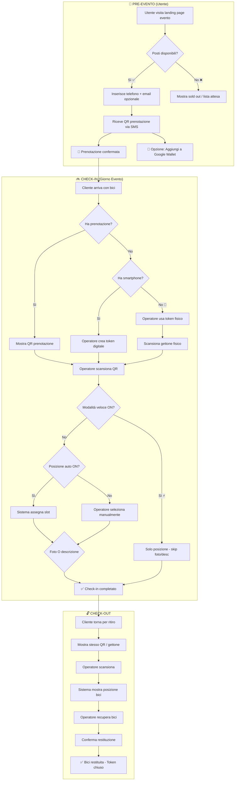

# 🚲 Dottò — Sistema Valet Biciclette per Eventi

> Un progetto di [Scintilla Cicloprogetti](https://www.scintillacicloprogetti.it/)

## 📋 Panoramica del Progetto

Progetta un sistema software completo per la gestione di un servizio valet per biciclette durante eventi. Il sistema supporta:
- **Token digitali** (QR via smartphone, integrabile con Google Wallet) — **preferenza default**
- **Token fisici** (gettoni plastificati con QR riutilizzabile) — **fallback per utenti senza smartphone**

### Obiettivi Primari
1. **Minima frizione utente**: registrazione con solo numero di telefono
2. **Prenotazione anticipata**: l'utente può prenotare prima dell'evento vedendo la disponibilità
3. **Efficienza operatore**: check-in rapido con modalità veloce nei momenti di punta
4. **Flessibilità**: adattamento dinamico al traffico (posizione auto, skip foto)

---

## 🎯 Principi di Design

### User Experience (Cliente)

| Dato | Obbligatorio | Uso |
|------|--------------|-----|
| Numero di telefono | ✅ | Ricezione ticket QR via SMS/WhatsApp |
| Email | ❌ | Conferma prenotazione + newsletter (opt-in) |

- **Zero account**: nessuna password, nessuna registrazione complessa
- **Prenotazione pre-evento**: l'utente vede i posti disponibili e prenota in anticipo
- **Ticket QR** inviato istantaneamente via SMS/WhatsApp
- **Integrazione Google Wallet**: il QR è aggiungibile direttamente al wallet con un tap
- **Link universale**: `https://dotto.bike/t/{token_id}` funziona per visualizzare QR, check-in e check-out

### Operator Experience
- Web app **mobile-first** ottimizzata per tablet/smartphone
- **Token digitale come default** — token fisico solo se cliente senza smartphone
- **Modalità veloce**: toggle per skip foto/descrizione nei momenti di punta
- **Posizione automatica**: assegnazione slot intelligente per velocizzare il flusso
- Operazioni rapide: check-in target <30 secondi in modalità veloce

---

## 🔄 Flusso Completo: Prenotazione → Check-in → Check-out


  
---

## 🧩 Funzionalità Dettagliate

### 1. Prenotazione (Lato Utente — Pre-Evento)

**URL Pubblico:** `https://dotto.bike/evento/{slug}`

L'utente può:
- Vedere disponibilità posti in tempo reale
- Prenotare inserendo solo il numero di telefono
- Aggiungere email (opzionale) per conferma e newsletter
- Ricevere QR via SMS/WhatsApp
- Aggiungere QR a Google Wallet

**Vincoli:**
- Un solo token attivo per numero di telefono per evento
- Prenotazione valida fino a fine evento (o orario configurabile)
- No-show: token scade automaticamente

### 2. Check-in (Lato Operatore)

**Priorità tipo token:**
1. **Token digitale** (default) — cliente con smartphone
2. **Token fisico** (fallback) — cliente senza smartphone

**Modalità operative:**

| Modalità | Posizione | Quando usarla |
|----------|-----------|---------------|
| Standard | Manuale | Traffico normale |
| Posizione Auto | Automatica | Traffico medio-alto |

**Logica Foto Bici:**
- **Token DIGITALE** → ❌ Foto NON richiesta (il cliente può sempre recuperare il QR dal telefono o tramite numero)
- **Token FISICO** → ✅ Foto OBBLIGATORIA (serve per identificare la bici in caso di smarrimento del gettone)

> ⚠️ **Perché solo per token fisici?**  
> Con un token digitale, se il cliente "perde" il QR può sempre recuperarlo tramite il suo numero di telefono. Con un token fisico non c'è questo legame, quindi la foto è l'unico modo per identificare la bici.

### 3. Check-out (Ritiro Bici)

- Cliente mostra QR (digitale o gettone fisico)
- Operatore scansiona
- Sistema mostra: posizione bici, foto (se presente), orario check-in
- Operatore recupera e restituisce bici
- Token marcato come `checked_out`
- Token fisici: tornano disponibili per riuso

### 4. Fallback Perdita Token

**Token DIGITALE smarrito:**
```
Cliente dice di aver perso il QR:
└── Ricerca per numero di telefono → QR recuperato istantaneamente ✅
```

**Token FISICO smarrito:**
```
Cliente ha perso il gettone:
├── Ricerca per fascia oraria check-in
├── Verifica visiva con foto archiviate 📸
├── Confronto bici fisica con foto
└── Rilascio manuale con log di override + motivo
```

> 💡 Ecco perché la foto è obbligatoria solo per i token fisici: è l'unico modo per identificare la bici senza un legame digitale.

### 5. Dashboard Operatori/Admin

- Lista bici attualmente parcheggiate
- Mappa visiva rastrelliere con slot occupati/liberi
- Storico check-in/check-out con filtri
- Statistiche evento in tempo reale
- Gestione multi-evento
- Gestione operatori (PIN login)

---

## 🏗️ Stack Tecnologico

### Frontend — React + Mantine

| Tecnologia | Versione | Uso |
|------------|----------|-----|
| React | 18+ | Framework UI |
| Vite | 5+ | Build tool |
| Mantine | 7+ | UI Component Library |
| React Router | 6+ | Routing |
| TanStack Query | 5+ | Data fetching & caching |
| html5-qrcode | latest | Scanner QR camera |
| Zustand | latest | State management leggero |

**Caratteristiche:**
- PWA-ready (installabile, offline base)
- Mobile-first responsive
- Scanner QR integrato via camera
- Compressione immagini client-side prima upload

### Backend — FastAPI (Python)

| Tecnologia | Uso |
|------------|-----|
| FastAPI | Framework API REST |
| SQLAlchemy 2.0 | ORM async |
| Pydantic | Validazione dati |
| Alembic | Migrazioni DB |
| python-jose | JWT tokens |
| Twilio / MessageBird | SMS/WhatsApp |
| google-auth | Google Wallet API |
| Pillow | Elaborazione immagini |

### Database — PostgreSQL

| Tecnologia | Uso |
|------------|-----|
| PostgreSQL 15+ | Database principale |
| pgcrypto | UUID generation |

### Infrastruttura

| Componente | Suggerimento |
|------------|--------------|
| Hosting Frontend | Vercel / Cloudflare Pages |
| Hosting Backend | Railway / Render / Fly.io |
| Database | Supabase / Neon / Railway |

---

## 📱 Interfacce Utente

### 1. Landing Page Prenotazione (Utente)

**URL:** `https://dotto.bike/evento/{slug}`

```
┌─────────────────────────────────────┐
│                                     │
│         🚲 Dottò               │
│                                     │
│      ══════════════════════         │
│       CONCERTO AL PARCO             │
│      ══════════════════════         │
│                                     │
│   📍 Parco Sempione, Milano         │
│   📅 Sabato 15 Gennaio 2026         │
│   ⏰ Check-in dalle 17:00           │
│                                     │
├─────────────────────────────────────┤
│                                     │
│   ┌─────────────────────────────┐   │
│   │   🅿️ POSTI DISPONIBILI      │   │
│   │                             │   │
│   │   ████████████░░░░░  78%    │   │
│   │   94 / 120 posti            │   │
│   │                             │   │
│   └─────────────────────────────┘   │
│                                     │
│   Prenota il tuo posto GRATIS       │
│   e salta la coda all'ingresso!     │
│                                     │
│   📱 Numero di telefono *           │
│   ┌─────────────────────────────┐   │
│   │ 🇮🇹 +39 │ 333 1234567        │   │
│   └─────────────────────────────┘   │
│                                     │
│   ✉️ Email (opzionale)              │
│   ┌─────────────────────────────┐   │
│   │ mario@email.it              │   │
│   └─────────────────────────────┘   │
│   ☐ Tienimi aggiornato su           │
│     prossimi eventi                 │
│                                     │
│   ┌─────────────────────────────┐   │
│   │      🎫 PRENOTA ORA         │   │
│   └─────────────────────────────┘   │
│                                     │
│   📲 Riceverai il QR via SMS        │
│                                     │
└─────────────────────────────────────┘
```

### 2. Pagina Conferma Prenotazione

```
┌─────────────────────────────────────┐
│                                     │
│         ✅ PRENOTATO!               │
│                                     │
│   ┌─────────────────────────────┐   │
│   │                             │   │
│   │         ▄▄▄▄▄▄▄▄▄           │   │
│   │         █ QR CODE █         │   │
│   │         █  DOT-   █         │   │
│   │         █  K8M2   █         │   │
│   │         ▀▀▀▀▀▀▀▀▀           │   │
│   │                             │   │
│   └─────────────────────────────┘   │
│                                     │
│   CONCERTO AL PARCO                 │
│   📍 Parco Sempione                 │
│   📅 15 Gen 2026                    │
│                                     │
│   ┌─────────────────────────────┐   │
│   │  📲 Aggiungi a Google Wallet │   │
│   └─────────────────────────────┘   │
│                                     │
│   ┌─────────────────────────────┐   │
│   │  📤 Condividi QR            │   │
│   └─────────────────────────────┘   │
│                                     │
│   ─────────────────────────────     │
│   📱 QR inviato a +39 333****567    │
│   ✉️ Conferma inviata a m***@e...   │
│                                     │
│   Mostra questo QR all'ingresso     │
│   con la tua bici!                  │
│                                     │
└─────────────────────────────────────┘
```

### 3. SMS/WhatsApp Conferma

```
🚲 Dottò - CONCERTO AL PARCO

✅ Prenotazione confermata!

🎫 Il tuo QR per il check-in:
https://dotto.bike/t/DOT-K8M2

📲 Aggiungi a Google Wallet:
https://dotto.bike/wallet/DOT-K8M2

📍 Presenta questo QR all'ingresso
   insieme alla tua bici.

⏰ Check-in attivo dalle 17:00

━━━━━━━━━━━━━━━━━━━━━
Hai bisogno di aiuto?
Rispondi a questo messaggio.
```

### 4. Dashboard Operatore — Check-in (Token Digitale)

```
┌─────────────────────────────────────┐
│  🚲 Dottò         [Evento ▼]  │
│  ┌─────────────────────────────┐    │
│  │ 🟢 94/120  │ 📍 26 liberi   │    │
│  └─────────────────────────────┘    │
├─────────────────────────────────────┤
│  ══════════════════════════════     │
│  🎫 TOKEN DIGITALE (consigliato)    │
│  ══════════════════════════════     │
│                                     │
│  ┌─────────────────────────────┐    │
│  │                             │    │
│  │   📷 SCANSIONA QR CLIENTE   │    │
│  │   (prenotazione esistente)  │    │
│  │                             │    │
│  └─────────────────────────────┘    │
│                                     │
│  ─────── oppure ───────             │
│                                     │
│  📱 Nuovo cliente (senza prenot.)   │
│  ┌─────────────────────────────┐    │
│  │ +39 │ Telefono cliente      │    │
│  └─────────────────────────────┘    │
│  ✉️ Email (opzionale)               │
│  ┌─────────────────────────────┐    │
│  │                             │    │
│  └─────────────────────────────┘    │
│  ☐ Newsletter                       │
│                                     │
│  ┄┄┄┄┄┄┄┄┄┄┄┄┄┄┄┄┄┄┄┄┄┄┄┄┄┄┄┄┄┄┄   │
│  📵 Cliente senza smartphone?       │
│      [ Usa Token Fisico → ]         │
│  ┄┄┄┄┄┄┄┄┄┄┄┄┄┄┄┄┄┄┄┄┄┄┄┄┄┄┄┄┄┄┄   │
│                                     │
├─────────────────────────────────────┤
│  📍 POSIZIONE BICI                  │
│                                     │
│  ┌─────────────────────────────┐    │
│  │ ⚡ Posizione automatica     🔘│   │
│  │   Rast. 3, Slot 7 assegnato  │   │
│  └─────────────────────────────┘    │
│                                     │
│  ── oppure (quando auto=OFF) ──     │
│  ┌──────────┐  ┌──────────┐         │
│  │ Rast. ▼ │  │ Slot  ▼ │         │
│  └──────────┘  └──────────┘         │
│                                     │
├─────────────────────────────────────┤
│                                     │
│  ┌─────────────────────────────┐    │
│  │      ✅ CONFERMA CHECK-IN   │    │
│  └─────────────────────────────┘    │
│                                     │
│  💡 Token digitale: nessuna foto    │
│     richiesta (recuperabile via     │
│     numero di telefono)             │
│                                     │
└─────────────────────────────────────┘
```

### 5. Schermata Token Fisico (Fallback)

```
┌─────────────────────────────────────┐
│  ← Indietro       TOKEN FISICO 📵  │
├─────────────────────────────────────┤
│                                     │
│  ⚠️ Usa solo se il cliente NON ha   │
│     smartphone disponibile          │
│                                     │
│    ┌─────────────────────────┐      │
│    │                         │      │
│    │   📷 SCANSIONA          │      │
│    │   GETTONE FISICO        │      │
│    │                         │      │
│    └─────────────────────────┘      │
│                                     │
│    Token scansionato:               │
│    ┌─────────────────────────┐      │
│    │  🎫 DOT-K8M2            │      │
│    │  ✅ Disponibile          │      │
│    └─────────────────────────┘      │
│                                     │
├─────────────────────────────────────┤
│  📍 POSIZIONE BICI                  │
│                                     │
│  ┌─────────────────────────────┐    │
│  │ ⚡ Posizione automatica     🔘│   │
│  │   Rast. 3, Slot 7 assegnato  │   │
│  └─────────────────────────────┘    │
│                                     │
├─────────────────────────────────────┤
│  📸 FOTO BICI (OBBLIGATORIA)        │
│                                     │
│  ┌──────────────────────────────┐   │
│  │                              │   │
│  │     [ 📷 SCATTA FOTO ]       │   │
│  │                              │   │
│  │  ⚠️ La foto è necessaria per │   │
│  │  identificare la bici in     │   │
│  │  caso di smarrimento del     │   │
│  │  gettone                     │   │
│  │                              │   │
│  └──────────────────────────────┘   │
│                                     │
│  ┌──────────┐                       │
│  │  🖼️      │  ✅ Foto acquisita    │
│  └──────────┘                       │
│                                     │
├─────────────────────────────────────┤
│                                     │
│  ┌─────────────────────────────┐    │
│  │      ✅ CONFERMA CHECK-IN   │    │
│  └─────────────────────────────┘    │
│                                     │
│  ━━━━━━━━━━━━━━━━━━━━━━━━━━━━━━━    │
│  📋 RICORDA:                        │
│  Consegna il gettone al cliente     │
│  dopo aver completato il check-in   │
│  ━━━━━━━━━━━━━━━━━━━━━━━━━━━━━━━    │
│                                     │
└─────────────────────────────────────┘
```

### 6. Schermata Check-out

```
┌─────────────────────────────────────┐
│  🚲 Dottò          CHECK-OUT  │
├─────────────────────────────────────┤
│                                     │
│    ┌─────────────────────────┐      │
│    │                         │      │
│    │   📷 SCANSIONA QR       │      │
│    │   cliente               │      │
│    │                         │      │
│    └─────────────────────────┘      │
│                                     │
│  ─────────────────────────────      │
│                                     │
│  🎫 DOT-K8M2                        │
│  📱 +39 333 ****567                 │
│                                     │
│  ┌─────────────────────────────┐    │
│  │                             │    │
│  │    📍 RASTRELLIERA 3        │    │
│  │       SLOT 7                │    │
│  │                             │    │
│  │    ⏰ Check-in: 17:42       │    │
│  │                             │    │
│  └─────────────────────────────┘    │
│                                     │
│  ┌─────────────────────────────┐    │
│  │  🖼️ Foto bici               │    │
│  │  [immagine della bici]      │    │  ← solo token fisici
│  └─────────────────────────────┘    │
│                                     │
│  ┌─────────────────────────────┐    │
│  │   ✅ CONFERMA RESTITUZIONE  │    │
│  └─────────────────────────────┘    │
│                                     │
│  ┌─────────────────────────────┐    │
│  │   ❓ Token smarrito?        │    │
│  └─────────────────────────────┘    │
│                                     │
└─────────────────────────────────────┘
```

### 7a. Recupero Token Digitale Smarrito

```
┌─────────────────────────────────────┐
│  ← Indietro   🔍 RECUPERA TOKEN    │
├─────────────────────────────────────┤
│                                     │
│  💡 Token DIGITALE smarrito?        │
│     Basta il numero di telefono!    │
│                                     │
│  📱 Numero telefono cliente         │
│  ┌─────────────────────────────┐    │
│  │ +39 333 1234567             │    │
│  └─────────────────────────────┘    │
│                                     │
│  [     🔍 CERCA TOKEN      ]        │
│                                     │
├─────────────────────────────────────┤
│  ✅ TOKEN TROVATO                   │
│                                     │
│  ┌─────────────────────────────┐    │
│  │  🎫 DOT-K8M2                │    │
│  │  📍 Rast. 3, Slot 7         │    │
│  │  ⏰ Check-in: 17:42         │    │
│  └─────────────────────────────┘    │
│                                     │
│  ┌─────────────────────────────┐    │
│  │   ✅ CONFERMA RESTITUZIONE  │    │
│  └─────────────────────────────┘    │
│                                     │
└─────────────────────────────────────┘
```

### 7b. Ricerca Fallback Token FISICO Smarrito

```
┌─────────────────────────────────────┐
│  ← Indietro   🔍 RICERCA BICI 📵   │
├─────────────────────────────────────┤
│                                     │
│  ⚠️ SOLO per token FISICI smarriti  │
│     (i digitali si recuperano via   │
│      numero di telefono)            │
│                                     │
│  ⏰ Orario approssimativo check-in  │
│  ┌────────────┐ ┌────────────┐      │
│  │ Dalle ▼   │ │ Alle  ▼   │      │
│  └────────────┘ └────────────┘      │
│                                     │
│  [       🔍 CERCA        ]          │
│                                     │
├─────────────────────────────────────┤
│  📋 RISULTATI (confronta con bici)  │
│                                     │
│  ┌─────────────────────────────┐    │
│  │ 🎫 DOT-K8M2  📵             │    │
│  │ 📍 Rast. 3, Slot 7          │    │
│  │ ⏰ 17:42                    │    │
│  │ ┌────────────────────┐      │    │
│  │ │                    │      │    │
│  │ │   🖼️ FOTO BICI     │      │    │
│  │ │                    │      │    │
│  │ └────────────────────┘      │    │
│  │  ⚠️ Confronta questa foto   │    │
│  │    con la bici del cliente  │    │
│  │         [ Seleziona → ]     │    │
│  └─────────────────────────────┘    │
│                                     │
│  ┌─────────────────────────────┐    │
│  │ 🎫 DOT-M4P9  📵             │    │
│  │ 📍 Rast. 1, Slot 3          │    │
│  │ ...                         │    │
│  └─────────────────────────────┘    │
│                                     │
└─────────────────────────────────────┘
```

---

## ⚛️ Componenti React Principali

### Struttura Progetto

```
src/
├── main.tsx
├── App.tsx
├── api/
│   ├── client.ts          # Axios/fetch wrapper
│   ├── events.ts          # API eventi
│   ├── tokens.ts          # API tokens
│   └── checkin.ts         # API checkin/checkout
├── components/
│   ├── common/
│   │   ├── QRScanner.tsx
│   │   ├── PhoneInput.tsx
│   │   └── PhotoCapture.tsx      # Per foto bici token fisici
│   ├── reservation/
│   │   ├── AvailabilityCard.tsx
│   │   └── ReservationForm.tsx
│   ├── checkin/
│   │   ├── PositionSelector.tsx
│   │   ├── PhysicalTokenPhoto.tsx  # Foto obbligatoria per token fisici
│   │   └── CheckinForm.tsx
│   ├── checkout/
│   │   ├── BikeDetails.tsx
│   │   └── CheckoutConfirm.tsx
│   └── search/
│       ├── DigitalTokenRecover.tsx  # Recupero token digitale via telefono
│       └── PhysicalBikeSearch.tsx   # Ricerca bici per token fisici smarriti
├── pages/
│   ├── public/
│   │   ├── EventPage.tsx      # Landing prenotazione
│   │   ├── TokenPage.tsx      # Visualizza QR
│   │   └── WalletPass.tsx     # Redirect Google Wallet
│   └── operator/
│       ├── LoginPage.tsx
│       ├── DashboardPage.tsx
│       ├── CheckinPage.tsx
│       ├── CheckoutPage.tsx
│       └── SearchPage.tsx
├── hooks/
│   ├── useCamera.ts
│   ├── useEventStats.ts
│   └── useCheckin.ts
├── stores/
│   └── operatorStore.ts    # Zustand
└── theme/
    └── mantineTheme.ts
```

---

## 📦 Output Richiesti

1. **Architettura tecnica completa** — Diagramma componenti frontend + backend + DB
2. **Schema DB PostgreSQL** — Con migrazioni Alembic
3. **API REST documentate** — Specifica OpenAPI/Swagger completa
4. **Backend FastAPI:**
   - Modelli SQLAlchemy
   - Endpoint check-in/check-out/prenotazione
   - Integrazione Twilio SMS/WhatsApp
   - Generazione Google Wallet pass
   - Validazione Pydantic
5. **Frontend React + Mantine:**
   - Setup progetto Vite
   - Tutti i componenti delle interfacce descritte
   - Scanner QR funzionante
   - PWA manifest
6. **Docker Compose** — Setup sviluppo locale completo
7. **Documentazione** — README con istruzioni deploy

---

## ⚙️ Note Implementative

- **UI Library**: Mantine 7+ (NO Tailwind)
- **Validazione telefono**: `libphonenumber-js` formato E.164
- **Rate limiting**: protezione endpoint pubblici `/reserve` e `/send-ticket`
- **Token format**: `DOT-XXXX` (prefisso Dottò + 4 caratteri alfanumerici, esclusi 0/O, 1/I/L per leggibilità)
- **QR URL**: sempre `https://dotto.bike/t/{token_code}`
- **Progetto**: Dottò by [Scintilla Cicloprogetti](https://www.scintillacicloprogetti.it/)
- **Compressione foto**: client-side prima upload (max 800px, 80% quality)
- **Timeout prenotazioni**: configurabile per evento, default fine evento


