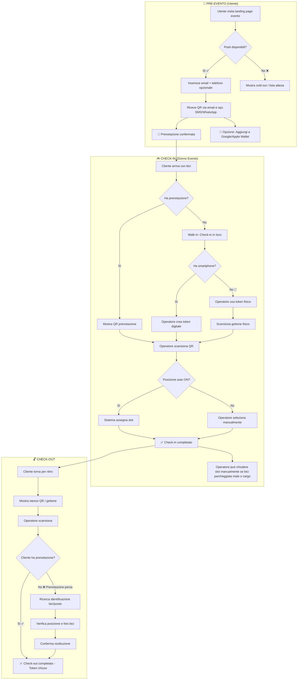

# 🚲 Dottò — Sistema Valet Biciclette per Eventi (100% Gratuito & Self-Hosted con WhatsApp)

> Un progetto di [Scintilla Cicloprogetti](https://www.scintillacicloprogetti.it/)

**Stack attuale**: **FastAPI + PostgreSQL** come backend, **React + Mantine** come frontend, **Brevo** per email (WhatsApp in valutazione). Hosting consigliato su **Hetzner Cloud VPS CX23** (€3.49/mese). **Foto OBBLIGATORIA solo per token fisici**, **zero foto per token digitali** (sempre).

## 📋 Panoramica del Progetto

Sistema completo gestione valet bici eventi con **token digitali QR** (default, Wallet ready) e **token fisici** (fallback). Telefono opzionale per **WhatsApp + SMS** oltre email.

**Aggiornamento Check-in:**
- ✅ **Token digitali**: **NO FOTO** (recuperabile via email)
- ✅ **Token fisici**: **FOTO OBBLIGATORIA** (bici senza smartphone)

Progetta un sistema software completo per la gestione di un servizio valet per biciclette durante eventi. Il sistema supporta:
- **Token digitali** (QR via smartphone, integrabile con Google Wallet e Apple Wallet) — **preferenza default**
- **Token fisici** (gettoni plastificati con QR riutilizzabile) — **fallback per utenti senza smartphone**

### Obiettivi Primari
1. **Minima frizione utente**: registrazione con solo email (telefono opzionale per SMS/WhatsApp - in valutazione)
2. **Prenotazione anticipata**: l'utente può prenotare prima dell'evento vedendo la disponibilità
3. **Efficienza operatore**: check-in rapido con modalità veloce nei momenti di punta
4. **Flessibilità**: adattamento dinamico al traffico (posizione auto, skip foto)

---

## 🌿 Branch e ambienti (dev / prod)

- **`develop`**: ambiente di sviluppo. Lavorare sempre qui per feature e fix.
- **`main`**: produzione. Solo release stabili; da qui si creano gli artifact di prod.

Dettaglio: [docs/BRANCHES.md](docs/BRANCHES.md).

**Setup sviluppo:** clonare il repo, poi `git checkout develop`. Creare il venv Python e avviare i container con il Makefile (vedi sotto).

---

## 🛠 Setup sviluppo (Makefile e venv)

**Prerequisiti:** Docker e Docker Compose, Node.js (per frontend), **Python 3.11** con modulo venv (su Pop!_OS/Debian/Ubuntu: `sudo apt install python3.11 python3.11-venv`). Per questo progetto usiamo **solo Python 3.11** nel venv (`make venv` crea `.venv` con `python3.11`).  
**Nota:** In `.venv/bin/` vedi `python`, `python3` e magari `python3.10`: sono *symlink* allo stesso interprete con cui è stato creato il venv. Se il venv è stato creato con 3.10, ricrealo con 3.11: `rm -rf .venv` e poi `make venv`. **Non disinstallare** il Python di sistema (`python3`, `python3.10`): il sistema operativo e i pacchetti (apt, GNOME, ecc.) ne hanno bisogno; tieni 3.11 *affiancato* e usa solo 3.11 per Dottò.

| Comando | Descrizione |
|--------|-------------|
| `make venv` | Crea `.venv` e installa le dipendenze Python dal **backend/pyproject.toml** (inclusi black, ruff, pytest in [dev]). |
| `make install-deps` | Reinstalla il backend in modalità editable con extra dev in `.venv`. |
| `make format` | Formatta il codice con **black** (`backend/app`). |
| `make lint` | Lint con **ruff** (solo check). |
| `make lint-fix` | Lint con ruff e auto-fix + format con ruff. |
| `make build` | Build immagini Docker. |
| `make up` | Avvia tutti i servizi (db PostgreSQL, backend FastAPI, frontend). |
| `make down` | Ferma i container. |
| `make reload` | down + build + up (ricarica tutto). |
| `make test` | Esegue test backend (pytest) e frontend (lint/test). |
| `make clean` | Rimuove container, volumi e `.venv`. |

Per questo progetto **non** usare dipendenze Python installate in sistema: creare e usare sempre il venv con `make venv` e attivarlo con `source .venv/bin/activate` quando lavori da terminale (es. pytest, script).

---

## 🎯 Principi di Design

### User Experience (Cliente)

| Dato | Obbligatorio | Uso |
|------|--------------|-----|
| Email | ✅ | Conferma prenotazione + link QR via email |
| Numero di telefono | ❌ | Opzionale: ricezione ticket QR via SMS o WhatsApp (in valutazione) |

- **Zero account**: nessuna password, nessuna registrazione complessa
- **Prenotazione pre-evento**: l'utente vede i posti disponibili e prenota in anticipo
- **Ticket QR** inviato via email (sempre) e SMS o WhatsApp (se telefono fornito - in valutazione)
- **Integrazione Wallet**: il QR è aggiungibile direttamente a Google Wallet o Apple Wallet con un tap
- **Link universale**: `https://dotto.bike/t/{token_id}` funziona per visualizzare QR, check-in e check-out

### Operator Experience
- Web app **mobile-first** ottimizzata per tablet/smartphone
- **Token digitale come default** — token fisico solo se cliente senza smartphone
- **Modalità veloce**: toggle per skip foto/descrizione nei momenti di punta
- **Posizione automatica**: assegnazione slot intelligente per velocizzare il flusso
- Operazioni rapide: check-in target <30 secondi in modalità veloce

---

## 🔄 Flusso Completo: Prenotazione → Check-in → Check-out


  
---

## 🧩 Funzionalità Dettagliate

### 1. Prenotazione (Lato Utente — Pre-Evento)

**URL Pubblico:** `https://dotto.bike/evento/{slug}`

L'utente può:
- Vedere disponibilità posti in tempo reale
- Prenotare inserendo email (obbligatoria)
- Aggiungere telefono (opzionale) per ricevere QR via SMS o WhatsApp (in valutazione)
- Ricevere QR via email (sempre) e SMS/WhatsApp (se telefono fornito - in valutazione)
- Aggiungere QR a Google Wallet o Apple Wallet
- **Checkbox opzionale newsletter**: opt-in per aggiornamenti su prossimi eventi

**Vincoli:**
- Un solo token attivo per email per evento
- Prenotazione valida fino a fine evento (o orario configurabile)
- No-show: token scade automaticamente

### 2. Check-in (Lato Operatore)

**Tipi di check-in:**
1. **Con prenotazione** — cliente ha già prenotato online, mostra QR
2. **Walk-in** — check-in in loco senza prenotazione

**Priorità tipo token (per walk-in):**
1. **Token digitale** (default) — cliente con smartphone
2. **Token fisico** (fallback) — cliente senza smartphone

**Modalità operative:**

| Modalità | Posizione | Quando usarla |
|----------|-----------|---------------|
| Standard | Manuale | Traffico normale |
| Posizione Auto | Automatica | Traffico medio-alto |

**Gestione slot:**
- Operatore può **chiudere manualmente** slot della rastrelliera
- Utile per: bici parcheggiate male, bici cargo che occupano più spazio, slot danneggiati
- Slot chiusi non vengono assegnati automaticamente dal sistema

**Verifica bici (check-out):**
- La **foto bici non è usata** per la verifica al check-out.
- **Metodo di verifica**: solo **posizione** (rastrelliera + slot). Il cliente **descrive la propria bici** all'operatore, che si reca in posizione e **verifica visivamente** che corrisponda prima di confermare la restituzione.

### 3. Check-out (Ritiro Bici)

**Flusso standard (cliente con prenotazione):**
- Cliente mostra QR (digitale o gettone fisico)
- Operatore scansiona
- Sistema verifica che il cliente abbia la prenotazione
- ✅ Check-out completato — Token marcato come `checked_out`
- Token fisici: tornano disponibili per riuso

**Flusso fallback (prenotazione persa):**
- Cliente non ha QR/gettone
- Operatore attiva ricerca per posizione/orario
- Sistema mostra: **posizione bici** (rastrelliera + slot), orario check-in
- Il **cliente descrive la bici** all'operatore (colore, tipo, accessori, ecc.)
- Operatore si reca in posizione e **verifica visivamente** che la bici corrisponda alla descrizione
- Conferma restituzione con override manuale
- Token marcato come `checked_out`

### 4. Fallback Perdita Token

**Token DIGITALE smarrito:**
```
Cliente dice di aver perso il QR:
└── Ricerca per email → QR recuperato istantaneamente ✅
```

**Token FISICO smarrito:**
```
Cliente ha perso il gettone:
├── Ricerca per fascia oraria check-in
├── Sistema mostra posizione (rastrelliera + slot)
├── Cliente descrive la bici all'operatore
├── Operatore verifica visivamente in loco
└── Rilascio manuale con log di override + motivo
```

### 5. Dashboard Operatori/Admin

- Lista bici attualmente parcheggiate
- Mappa visiva rastrelliere con slot occupati/liberi/chiusi
- Gestione slot chiusi manualmente (per bici cargo, slot danneggiati, bici parcheggiate male)
- Storico check-in/check-out con filtri
- Statistiche evento in tempo reale
- Gestione multi-evento
- Gestione operatori (PIN login)

---

## 🏗️ Stack Tecnologico

### Frontend — React + Mantine

| Tecnologia | Versione | Uso |
|------------|----------|-----|
| React | 18+ | Framework UI |
| Vite | 5+ | Build tool |
| Mantine | 7+ | UI Component Library |
| React Router | 6+ | Routing |
| TanStack Query | 5+ | Data fetching & caching |
| html5-qrcode | latest | Scanner QR camera |
| Zustand | latest | State management leggero |

**Caratteristiche:**
- PWA-ready (installabile, offline base)
- Mobile-first responsive
- Scanner QR integrato via camera
- Compressione immagini client-side prima upload

### Backend — FastAPI (Python)

| Tecnologia | Uso |
|------------|-----|
| FastAPI | Framework API REST |
| SQLAlchemy 2.0 | ORM async |
| Pydantic | Validazione dati |
| Alembic | Migrazioni DB |
| python-jose | JWT tokens |
| Twilio / MessageBird | SMS/WhatsApp (in valutazione) |
| google-auth | Google Wallet API |
| passkit | Apple Wallet API |
| Pillow | Elaborazione immagini |

### Database — PostgreSQL

| Tecnologia | Uso |
|------------|-----|
| PostgreSQL 15+ | Database principale |
| pgcrypto | UUID generation |

### Media Storage

| Opzione | Pro |
|---------|-----|
| Supabase Storage | Integrato, facile setup |
| Cloudflare R2 | Economico, S3-compatible |
| AWS S3 | Standard enterprise |

### Infrastruttura

| Componente | Suggerimento |
|------------|--------------|
| Hosting Frontend | Vercel / Cloudflare Pages |
| Hosting Backend | Railway / Render / Fly.io |
| Database | Supabase / Neon / Railway |

### 🆓 Stack Tecnologico (100% Gratuito / Self-Hosted)

| Componente | Tecnologia | Uso |
|------------|------------|-----|
| **Backend** | **FastAPI + PostgreSQL** | API REST + database principale |
| **Frontend** | React + Mantine | PWA mobile-first |
| **Email** | **Brevo SMTP** | 300 email/giorno free (tier gratuito) |
| **WhatsApp** | **Brevo WhatsApp API** (opzionale) | Notifiche QR (a consumo) |
| **Hosting** | **Hetzner CX23** | €3.49/mese, 4GB RAM, 40GB NVMe |

---

## 🔄 Flusso Check-in Semplificato (NO Modalità Veloce)

```
CHECK-IN (Giorno Evento)
├── Cliente arriva con bici
├── Ha prenotazione?
│   ├── Sì → Scansiona QR digitale → ✅ NO FOTO → Assegna slot
│   └── No → Walk-in
│       ├── Ha smartphone? → Token DIGITALE → ✅ NO FOTO
│       └── NO smartphone → Token FISICO → 📸 FOTO OBBLIGATORIA
└── Posizione auto/manuale → ✅ Check-in completato
```

## 🧩 Funzionalità Check-in Aggiornate

### Check-in Token Digitale (Default)

```
┌─────────────────────────────────────┐
│  🚲 Dottò    [Evento ▼]      PIN:***│
│  🟢 94/120  │ 26 liberi            │
├─────────────────────────────────────┤
│  ══════════════════════════════     │
│  🎫 TOKEN DIGITALE                 │
│  ┌─────────────────────────────┐    │
│  │   📷 SCANSIONA QR CLIENTE   │    │
│  └─────────────────────────────┘    │
│                                     │
│  📍 Rast. 3, Slot 7 (auto)         │
│  ✅ NESSUNA FOTO RICHIESTA          │
│                                     │
└─────────────────────────────────────┘
```

### Check-in Token Fisico (Fallback)

```
┌─────────────────────────────────────┐
│  TOKEN FISICO 📵  ← Cliente NO smartphone │
├─────────────────────────────────────┤
│  📷 SCANSIONA GETTONE FISICO        │
│  Token: DOT-K8M2  ✅ Disponibile    │
├─────────────────────────────────────┤
│  📸 FOTO BICI ★OBBLIGATORIA★       │
│  ┌─────────────────────────────┐    │
│  │  📷 [Camera Preview]        │    │
│  │  Compila: 800x600, 80% JPEG │    │
│  └─────────────────────────────┘    │
├─────────────────────────────────────┤
│  📍 Rast. 3, Slot 7                 │
│  [ ✅ CONFERMA CHECK-IN ]           │
└─────────────────────────────────────┘
```

---

## 📱 Interfacce Operatore Aggiornate

### Walk-in: Scelta Token Type

```
🚶 Walk-in: Nuovo cliente
✉️ Email cliente *
📱 Telefono (opzionale)

┌─────────────────┐ ┌─────────────────┐
│ 🎫 Token        │ │ 📵 Token        │
│ DIGITALE        │ │ FISICO          │
│ ✅ NO FOTO      │ │ 📸 FOTO ★OBBL★ │
└─────────────────┘ └─────────────────┘
```

### Dashboard Operatore (statistiche realtime)

```
📊 STATISTICHE REALTIME
Token Digitali: 78  (NO foto)
Token Fisici:   4   (📸 foto scattate)
Slot Occupati:  82/120
📵 Clienti NO smartphone: 4%
```

---

## 📱 Interfacce Utente

### 1. Landing Page Prenotazione (Utente)

**URL:** `https://dotto.bike/evento/{slug}`

```
┌─────────────────────────────────────┐
│                                     │
│         🚲 Dottò               │
│                                     │
│      ══════════════════════         │
│       CONCERTO AL PARCO             │
│      ══════════════════════         │
│                                     │
│   📍 Parco Sempione, Milano         │
│   📅 Sabato 15 Gennaio 2026         │
│   ⏰ Check-in dalle 17:00           │
│                                     │
├─────────────────────────────────────┤
│                                     │
│   ┌─────────────────────────────┐   │
│   │   🅿️ POSTI DISPONIBILI      │   │
│   │                             │   │
│   │   ████████████░░░░░  78%    │   │
│   │   94 / 120 posti            │   │
│   │                             │   │
│   └─────────────────────────────┘   │
│                                     │
│   Prenota il tuo posto GRATIS       │
│   e salta la coda all'ingresso!     │
│                                     │
│   ✉️ Email *                         │
│   ┌─────────────────────────────┐   │
│   │ mario@email.it               │   │
│   └─────────────────────────────┘   │
│                                     │
│   📱 Numero di telefono (opzionale) │
│   ┌─────────────────────────────┐   │
│   │ 🇮🇹 +39 │ 333 1234567        │   │
│   └─────────────────────────────┘   │
│                                     │
│   ☐ Newsletter (opzionale)          │
│     Tienimi aggiornato su prossimi  │
│     eventi                          │
│                                     │
│   💡 Riceverai il QR via email      │
│      (+ SMS/WhatsApp se fornisci     │
│       il telefono - in valutazione)  │
│                                     │
│   ┌─────────────────────────────┐   │
│   │      🎫 PRENOTA ORA         │   │
│   └─────────────────────────────┘   │
│                                     │
│   📧 Riceverai il QR via email      │
│   📲 (+ SMS/WhatsApp se fornisci     │
│      il telefono - in valutazione)  │
│                                     │
└─────────────────────────────────────┘
```

### 2. Pagina Conferma Prenotazione

```
┌─────────────────────────────────────┐
│                                     │
│         ✅ PRENOTATO!               │
│                                     │
│   ┌─────────────────────────────┐   │
│   │                             │   │
│   │         ▄▄▄▄▄▄▄▄▄           │   │
│   │         █ QR CODE █         │   │
│   │         █  DOT-   █         │   │
│   │         █  K8M2   █         │   │
│   │         ▀▀▀▀▀▀▀▀▀           │   │
│   │                             │   │
│   └─────────────────────────────┘   │
│                                     │
│   CONCERTO AL PARCO                 │
│   📍 Parco Sempione                 │
│   📅 15 Gen 2026                    │
│                                     │
│   ┌─────────────────────────────┐   │
│   │  📲 Aggiungi a Wallet        │   │
│   │     (Google/Apple)           │   │
│   └─────────────────────────────┘   │
│                                     │
│   ┌─────────────────────────────┐   │
│   │  📤 Condividi QR            │   │
│   └─────────────────────────────┘   │
│                                     │
│   ─────────────────────────────     │
│   ✉️ QR inviato a m***@e...         │
│   📱 (+ SMS/WhatsApp a +39 333****567)│
│      (se telefono fornito - in valutazione)│
│                                     │
│   Mostra questo QR all'ingresso     │
│   con la tua bici!                  │
│                                     │
└─────────────────────────────────────┘
```

### 3. SMS/WhatsApp Conferma (in valutazione)

```
🚲 Dottò - CONCERTO AL PARCO

✅ Prenotazione confermata!

🎫 Il tuo QR per il check-in:
https://dotto.bike/t/DOT-K8M2

📧 QR inviato anche via email

📲 Aggiungi a Google/Apple Wallet:
https://dotto.bike/wallet/DOT-K8M2

📍 Presenta questo QR all'ingresso
   insieme alla tua bici.

⏰ Check-in attivo dalle 17:00

━━━━━━━━━━━━━━━━━━━━━
Hai bisogno di aiuto?
Rispondi a questo messaggio.
```

### 4. Dashboard Operatore — Check-in (Token Digitale)

```
┌─────────────────────────────────────┐
│  🚲 Dottò         [Evento ▼]  │
│  ┌─────────────────────────────┐    │
│  │ 🟢 94/120  │ 📍 26 liberi   │    │
│  └─────────────────────────────┘    │
├─────────────────────────────────────┤
│  ══════════════════════════════     │
│  🎫 TOKEN DIGITALE (consigliato)    │
│  ══════════════════════════════     │
│                                     │
│  ┌─────────────────────────────┐    │
│  │                             │    │
│  │   📷 SCANSIONA QR CLIENTE   │    │
│  │   (prenotazione esistente)  │    │
│  │                             │    │
│  └─────────────────────────────┘    │
│                                     │
│  ─────── oppure ───────             │
│                                     │
│  🚶 Walk-in: Nuovo cliente          │
│     (senza prenotazione)             │
│  ✉️ Email cliente *                 │
│  ┌─────────────────────────────┐    │
│  │ mario@email.it              │    │
│  └─────────────────────────────┘    │
│  📱 Telefono (opzionale)             │
│  ┌─────────────────────────────┐    │
│  │ +39 │ Telefono cliente      │    │
│  └─────────────────────────────┘    │
│  ☐ Newsletter (opzionale)           │
│     Tienimi aggiornato su prossimi  │
│     eventi                          │
│                                     │
│  ┄┄┄┄┄┄┄┄┄┄┄┄┄┄┄┄┄┄┄┄┄┄┄┄┄┄┄┄┄┄┄   │
│  📵 Cliente senza smartphone?       │
│      [ Usa Token Fisico → ]         │
│  ┄┄┄┄┄┄┄┄┄┄┄┄┄┄┄┄┄┄┄┄┄┄┄┄┄┄┄┄┄┄┄   │
│                                     │
├─────────────────────────────────────┤
│  📍 POSIZIONE BICI                  │
│                                     │
│  ┌─────────────────────────────┐    │
│  │ ⚡ Posizione automatica     🔘│   │
│  │   Rast. 3, Slot 7 assegnato  │   │
│  └─────────────────────────────┘    │
│                                     │
│  ── oppure (quando auto=OFF) ──     │
│  ┌──────────┐  ┌──────────┐         │
│  │ Rast. ▼ │  │ Slot  ▼ │         │
│  └──────────┘  └──────────┘         │
│                                     │
│  🔒 Gestione Slot                   │
│  ┌─────────────────────────────┐    │
│  │ [ Chiudi slot manualmente ] │    │
│  │ Utile per: bici cargo,      │    │
│  │ slot danneggiati, bici      │    │
│  │ parcheggiate male          │    │
│  └─────────────────────────────┘    │
│                                     │
├─────────────────────────────────────┤
│                                     │
│  ┌─────────────────────────────┐    │
│  │      ✅ CONFERMA CHECK-IN   │    │
│  └─────────────────────────────┘    │
│                                     │
│  💡 Token digitale: nessuna foto    │
│     richiesta (recuperabile via     │
│     email)                          │
│                                     │
└─────────────────────────────────────┘
```

### 5. Schermata Token Fisico (Fallback)

```
┌─────────────────────────────────────┐
│  ← Indietro       TOKEN FISICO 📵  │
├─────────────────────────────────────┤
│                                     │
│  ⚠️ Usa solo se il cliente NON ha   │
│     smartphone disponibile          │
│                                     │
│    ┌─────────────────────────┐      │
│    │                         │      │
│    │   📷 SCANSIONA          │      │
│    │   GETTONE FISICO        │      │
│    │                         │      │
│    └─────────────────────────┘      │
│                                     │
│    Token scansionato:               │
│    ┌─────────────────────────┐      │
│    │  🎫 DOT-K8M2            │      │
│    │  ✅ Disponibile          │      │
│    └─────────────────────────┘      │
│                                     │
├─────────────────────────────────────┤
│  📍 POSIZIONE BICI                  │
│                                     │
│  ┌─────────────────────────────┐    │
│  │ ⚡ Posizione automatica     🔘│   │
│  │   Rast. 3, Slot 7 assegnato  │   │
│  └─────────────────────────────┘    │
│                                     │
├─────────────────────────────────────┤
│  ┌─────────────────────────────┐    │
│  │      ✅ CONFERMA CHECK-IN   │    │
│  └─────────────────────────────┘    │
│                                     │
│  ━━━━━━━━━━━━━━━━━━━━━━━━━━━━━━━    │
│  📋 RICORDA:                        │
│  Consegna il gettone al cliente     │
│  dopo aver completato il check-in.  │
│  Al ritiro: verifica per posizione  │
│  + descrizione bici dal cliente.    │
│  ━━━━━━━━━━━━━━━━━━━━━━━━━━━━━━━    │
│                                     │
└─────────────────────────────────────┘
```

### 6. Schermata Check-out

```
┌─────────────────────────────────────┐
│  🚲 Dottò          CHECK-OUT  │
├─────────────────────────────────────┤
│                                     │
│    ┌─────────────────────────┐      │
│    │                         │      │
│    │   📷 SCANSIONA QR       │      │
│    │   cliente               │      │
│    │                         │      │
│    └─────────────────────────┘      │
│                                     │
│  ─────────────────────────────      │
│                                     │
│  🎫 DOT-K8M2                        │
│  ✅ Prenotazione verificata        │
│                                     │
│  ┌─────────────────────────────┐    │
│  │   ✅ CONFERMA RESTITUZIONE  │    │
│  └─────────────────────────────┘    │
│                                     │
│  ─────────────────────────────      │
│                                     │
│  ┌─────────────────────────────┐    │
│  │   ❓ Prenotazione persa?    │    │
│  │   [ Cerca bici/posto → ]  │    │
│  └─────────────────────────────┘    │
│                                     │
└─────────────────────────────────────┘
```

**Flusso con prenotazione persa:**

```
┌─────────────────────────────────────┐
│  ← Indietro   🔍 RICERCA BICI      │
├─────────────────────────────────────┤
│                                     │
│  ⚠️ Prenotazione persa -            │
│     Identificazione bici/posto      │
│                                     │
│  ✉️ Email (token digitale)          │
│  ┌─────────────────────────────┐    │
│  │ mario@email.it               │    │
│  └─────────────────────────────┘    │
│                                     │
│  ─── oppure ───                     │
│                                     │
│  ⏰ Orario check-in (token fisico)  │
│                                     │
│  [       🔍 CERCA        ]          │
│                                     │
├─────────────────────────────────────┤
│  📋 RISULTATI                        │
│                                     │
│  ┌─────────────────────────────┐    │
│  │ 🎫 DOT-K8M2                 │    │
│  │ 📍 Rast. 3, Slot 7          │    │
│  │ ⏰ 17:42                     │    │
│  │                             │    │
│  │ Cliente descrive la bici →  │    │
│  │ operatore verifica in loco  │    │
│  │         [ Seleziona → ]     │    │
│  └─────────────────────────────┘    │
│                                     │
│  ┌─────────────────────────────┐    │
│  │   ✅ CONFERMA RESTITUZIONE  │    │
│  └─────────────────────────────┘    │
│                                     │
└─────────────────────────────────────┘
```

### 7a. Recupero Token Digitale Smarrito

```
┌─────────────────────────────────────┐
│  ← Indietro   🔍 RECUPERA TOKEN    │
├─────────────────────────────────────┤
│                                     │
│  💡 Token DIGITALE smarrito?        │
│     Basta l'email!                  │
│                                     │
│  ✉️ Email cliente                   │
│  ┌─────────────────────────────┐    │
│  │ mario@email.it               │    │
│  └─────────────────────────────┘    │
│                                     │
│  [     🔍 CERCA TOKEN      ]        │
│                                     │
├─────────────────────────────────────┤
│  ✅ TOKEN TROVATO                   │
│                                     │
│  ┌─────────────────────────────┐    │
│  │  🎫 DOT-K8M2                │    │
│  │  📍 Rast. 3, Slot 7         │    │
│  │  ⏰ Check-in: 17:42         │    │
│  └─────────────────────────────┘    │
│                                     │
│  ┌─────────────────────────────┐    │
│  │   ✅ CONFERMA RESTITUZIONE  │    │
│  └─────────────────────────────┘    │
│                                     │
└─────────────────────────────────────┘
```

### 7b. Ricerca Fallback Token FISICO Smarrito

```
┌─────────────────────────────────────┐
│  ← Indietro   🔍 RICERCA BICI 📵   │
├─────────────────────────────────────┤
│                                     │
│  ⚠️ SOLO per token FISICI smarriti  │
│     (i digitali si recuperano via   │
│      email)                          │
│                                     │
│  ⏰ Orario approssimativo check-in  │
│  ┌────────────┐ ┌────────────┐      │
│  │ Dalle ▼   │ │ Alle  ▼   │      │
│  └────────────┘ └────────────┘      │
│                                     │
│  [       🔍 CERCA        ]          │
│                                     │
├─────────────────────────────────────┤
│  📋 RISULTATI (posizione + descrizione bici)  │
│                                     │
│  ┌─────────────────────────────┐    │
│  │ 🎫 DOT-K8M2  📵             │    │
│  │ 📍 Rast. 3, Slot 7          │    │
│  │ ⏰ 17:42                    │    │
│  │                             │    │
│  │ Cliente descrive la bici →  │    │
│  │ operatore verifica in loco  │    │
│  │         [ Seleziona → ]     │    │
│  └─────────────────────────────┘    │
│                                     │
│  ┌─────────────────────────────┐    │
│  │ 🎫 DOT-M4P9  📵             │    │
│  │ 📍 Rast. 1, Slot 3          │    │
│  │ ...                         │    │
│  └─────────────────────────────┘    │
│                                     │
└─────────────────────────────────────┘
```

---

## ⚛️ Componenti React Principali

### Struttura Progetto

```
src/
├── main.tsx
├── App.tsx
├── api/
│   ├── client.ts          # Axios/fetch wrapper
│   ├── events.ts          # API eventi
│   ├── tokens.ts          # API tokens
│   └── checkin.ts         # API checkin/checkout
├── components/
│   ├── common/
│   │   ├── QRScanner.tsx
│   │   ├── PhoneInput.tsx
│   │   └── PhotoCapture.tsx      # Solo per token fisici
│   ├── reservation/
│   │   ├── AvailabilityCard.tsx
│   │   └── ReservationForm.tsx
│   ├── checkin/
│   │   ├── TokenTypeSelector.tsx     # NUOVO: Digital vs Physical
│   │   ├── DigitalCheckin.tsx        # NO foto, scanner QR
│   │   ├── PhysicalCheckin.tsx       # PhotoCapture obbligatorio
│   │   ├── PositionSelector.tsx
│   │   └── CheckinForm.tsx
│   ├── checkout/
│   │   ├── BikeDetails.tsx
│   │   └── CheckoutConfirm.tsx
│   └── search/
│       ├── DigitalTokenRecover.tsx  # Recupero token digitale via telefono
│       └── PhysicalBikeSearch.tsx   # Ricerca bici per token fisici smarriti
├── pages/
│   ├── public/
│   │   ├── EventPage.tsx      # Landing prenotazione
│   │   ├── TokenPage.tsx      # Visualizza QR
│   │   └── WalletPass.tsx     # Redirect Google/Apple Wallet
│   └── operator/
│       ├── LoginPage.tsx
│       ├── DashboardPage.tsx
│       ├── CheckinPage.tsx
│       ├── CheckoutPage.tsx
│       └── SearchPage.tsx
├── hooks/
│   ├── useCamera.ts
│   ├── useEventStats.ts
│   └── useCheckin.ts
├── stores/
│   └── operatorStore.ts    # Zustand
└── theme/
    └── mantineTheme.ts
```

**Esempio React Token Type (Walk-in):**

```tsx
const CheckinWalkin = () => {
  const [tokenType, setTokenType] = useState<'digital'|'physical'>('digital');
  
  return (
    <Radio.Group value={tokenType} onChange={setTokenType}>
      <Radio value="digital" label="🎫 Token Digitale (NO foto)" />
      <Radio value="physical" label="📵 Token Fisico (FOTO obbligatoria)" />
      {tokenType === 'physical' && <PhotoCapture required />}
    </Radio.Group>
  );
};
```

---

## 📦 Output Richiesti

1. **Architettura tecnica completa** — Diagramma componenti frontend + backend + DB
2. **Schema DB PostgreSQL** — Con migrazioni Alembic
3. **API REST documentate** — Specifica OpenAPI/Swagger completa
4. **Backend FastAPI:**
   - Modelli SQLAlchemy
   - Endpoint check-in/check-out/prenotazione
   - Integrazione Twilio SMS/WhatsApp (in valutazione)
   - Generazione Google Wallet e Apple Wallet pass
   - Validazione Pydantic
5. **Frontend React + Mantine:**
   - Setup progetto Vite
   - Tutti i componenti delle interfacce descritte
   - Scanner QR funzionante
   - PWA manifest
6. **Docker Compose** — Setup sviluppo locale completo
7. **Documentazione** — README con istruzioni deploy

---

## ⚙️ Note Implementative

- **UI Library**: Mantine 7+ (NO Tailwind)
- **Validazione email**: formato standard email (obbligatoria)
- **Validazione telefono**: `libphonenumber-js` formato E.164 (opzionale, se fornito)
- **Rate limiting**: protezione endpoint pubblici `/reserve` e `/send-ticket`
- **Token format**: `DOT-XXXX` (prefisso Dottò + 4 caratteri alfanumerici, esclusi 0/O, 1/I/L per leggibilità)
- **QR URL**: sempre `https://dotto.bike/t/{token_code}`
- **Progetto**: Dottò by [Scintilla Cicloprogetti](https://www.scintillacicloprogetti.it/)
- **Compressione foto**: client-side prima upload (max 800px, 80% quality)
- **Timeout prenotazioni**: configurabile per evento, default fine evento
- **Wallet integration**: Supporto Google Wallet (Android) e Apple Wallet (iOS) per aggiunta pass QR
- **Gestione slot chiusi**: Operatore può chiudere manualmente slot della rastrelliera per bici cargo, slot danneggiati, o bici parcheggiate male. Slot chiusi non vengono assegnati automaticamente
- **Check-out semplificato**: Verifica solo prenotazione. Identificazione bici/posto richiesta solo se prenotazione persa (fallback)
- **Verifica bici (anche in fallback)**: solo **posizione** (rastrelliera + slot). Niente foto: il cliente **descrive la bici** all'operatore, che verifica visivamente in loco prima di confermare
- **Newsletter**: checkbox opzionale (opt-in) in prenotazione e walk-in
- **Walk-in**: Termine per check-in in loco senza prenotazione pre-evento

---

## 🚀 Deploy (Stack 100% Gratuito)

**Hetzner CX23** (€3.49/mese) + **Docker Compose** + **Brevo** (email + WhatsApp opzionale).

**Costo Totale**: €42/anno VPS + 0€ software. Foto storage (per token fisici) stimata ~1MB/token con compressione lato client.

---

## ✅ Vantaggi Simplificazione

- **Token digitali (95% casi)**: Check-in <15s (solo scanner QR)
- **Token fisici (5% casi)**: Foto obbligatoria per tracciamento visivo
- **No modalità veloce**: Sempre standard, UX prevedibile
- **Verifica check-out**: Posizione + descrizione cliente (operatore verifica in loco); foto solo per token fisici se utile in fallback

**Tempo implementativo**: -1h (no toggle veloce). MVP completo **18h**.


