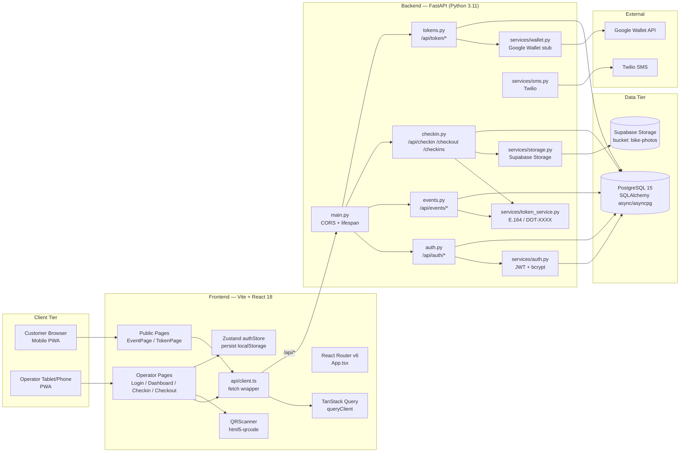
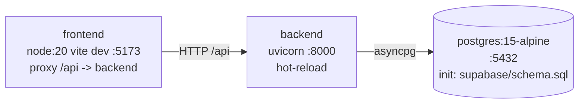
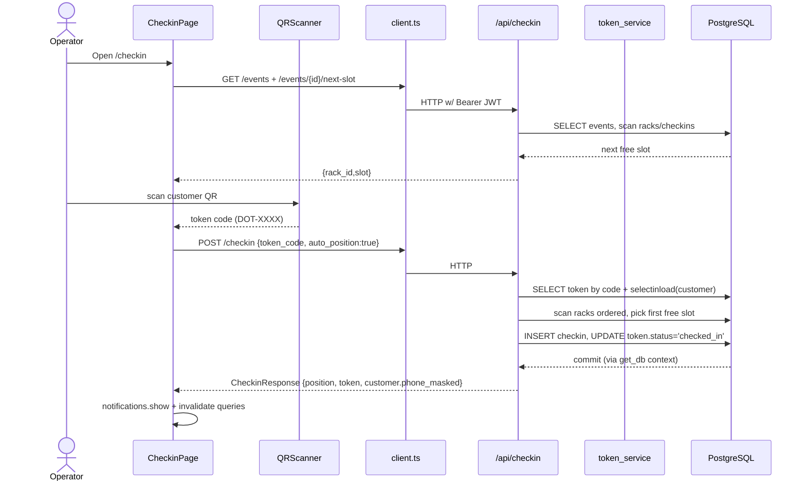
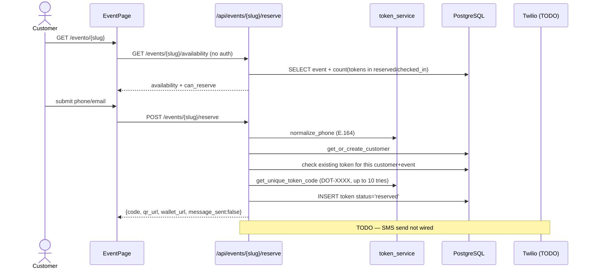
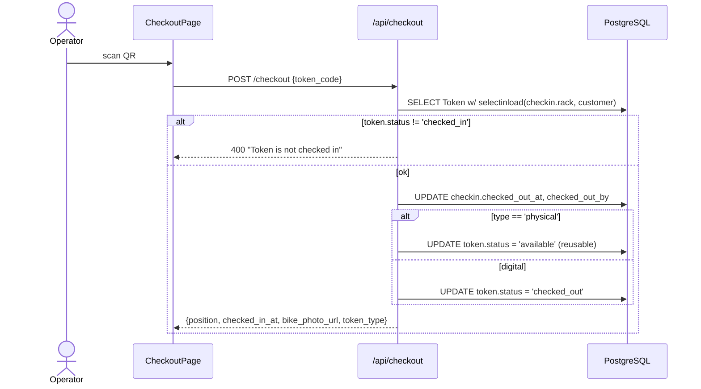

# Architecture Diagram — Dottò

## Component Map

## Deployment Topology (docker-compose)

## Request Flow — Operator Check-in (digital, auto-position)

## Request Flow — Public Reservation

## Request Flow — Check-out

