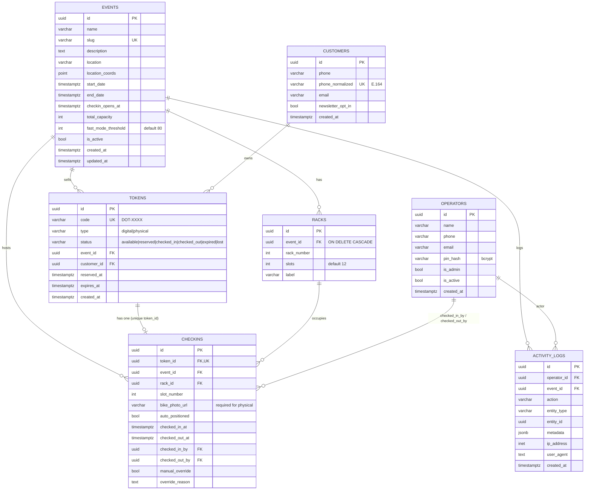

# Entity-Relationship Diagram — Dottò

Defined in [db/schema.sql](../../db/schema.sql) and mirrored in SQLAlchemy [backend/app/models/](../../backend/app/models/).

## Key Constraints & Indexes

| Table      | Constraint / Index                                         | Purpose                                               |
|------------|------------------------------------------------------------|-------------------------------------------------------|
| `events`   | `slug UNIQUE`                                              | Public URL path `/evento/{slug}`                      |
| `racks`    | `UNIQUE (event_id, rack_number)`                           | No duplicate rack numbering per event                 |
| `customers`| `UNIQUE (phone_normalized)`                                | One customer per E.164 number                         |
| `tokens`   | `UNIQUE (code)`, `CHECK type IN (...)`, `CHECK status IN (...)` | Token identity + state machine                  |
| `tokens`   | `idx_tokens_customer_event`, `idx_tokens_status`           | Recovery lookups, status filters                      |
| `checkins` | `token_id UNIQUE`                                          | One checkin row per token (lifetime); re-checkins require new token for digital type |
| `checkins` | `UNIQUE (rack_id, slot_number, checked_out_at)`            | Allows slot reuse: multiple rows may share slot, but only one with `checked_out_at IS NULL` |
| `checkins` | `idx_checkins_active` (partial `WHERE checked_out_at IS NULL`) | Fast "active parked bikes" queries               |
| `activity_logs` | `idx_logs_event (event_id, created_at DESC)`          | Timeline queries                                      |

## Views & Functions

- `VIEW event_availability` — computes `occupied/available/occupancy_percent` per active event.
- `VIEW available_slots` — `CROSS JOIN generate_series(1, r.slots)` minus occupied.
- `FUNCTION get_next_available_slot(event_id)` — returns first free slot ordered by `rack_number, slot_number`.
- `FUNCTION generate_token_code()` — DB-side DOT-XXXX generator (unused by backend; backend reimplements in [token_service.py](../../backend/app/services/token_service.py)).

## Token State Machine

```mermaid
stateDiagram-v2
    [*] --> reserved: POST /events/{slug}/reserve (digital)
    [*] --> available: Physical token seed (manual)
    available --> checked_in: POST /checkin (physical path)
    reserved --> checked_in: POST /checkin
    reserved --> expired: (no-show; NOT YET IMPLEMENTED)
    checked_in --> checked_out: POST /checkout (digital)
    checked_in --> available: POST /checkout (physical — reusable)
    checked_out --> [*]
    available --> lost: manual admin action (NOT IMPLEMENTED)
```

